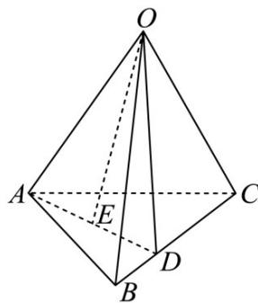

> [!faq]- 《专题01 空间向量及其运算（八大题型）（高效培优期中专项训练）数学人教A版2019高二选择性必修第一册》官方解析
>
> > [!success]- **【答案】** B
>
> > [!note]- **【分析】**
> > 利用空间向量的线性运算计算即可·
>
> > [!note]- **【解析】**
> > 由题意 $OE=\frac{1}{2}\left(OA+OD\right)=\frac{1}{2}OA+\frac{1}{2}\left(OB+BD\right)=\frac{1}{2}OA+\frac{1}{2}\left(OB+xBC\right)$
> >
> > $$
> > = \frac {1}{2} \square O A + \frac {1}{2} \square O B + \frac {x}{2} \left(\square O C - \square O B\right) = \frac {1}{2} \square O A + \frac {1 - x}{2} \square O B + \frac {x}{2} \square O C
> > $$
> >
> > 所以 $\frac{1}{2} a + \frac{1 - x}{2} b + \frac{x}{2} c = \frac{1}{2} a + \frac{1}{3} b + \frac{1}{6} c$ ，解得 $x = \frac{1}{3}$
> >
> > 
> >
> > 故选 **B**
