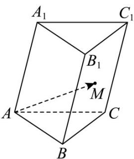

> [!faq]- 《专题01 空间向量及其运算（八大题型）（高效培优期中专项训练）数学人教A版2019高二选择性必修第一册》官方解析
>
> > [!success]- **【答案】** A
>
> > [!note]- **【分析】**
> > 根据条件，利用空间向量的线性运算，即可求出结果·
>
> > [!note]- **【解析】**
> > 根据题意， $AM = AB + BM = AB + \frac{1}{2} BC_{1} = AB + \frac{1}{2}(BB_{1} + BC)$
> >
> > 又 $\stackrel{\square\square\square}{BC} = \stackrel{\square\square\square}{AC} - \stackrel{\square\square\square}{AB}$ ，所以 $\stackrel{\square\square\square\square}{AM} = \frac{1}{2} AB + \frac{1}{2} BB_{1} + \frac{1}{2} AC = \frac{1}{2} a + \frac{1}{2} b + \frac{1}{2} c$ ，
> >
> > 
> >
> > 故选：A.
> >
> > 考点07 求空间向量的数量积
