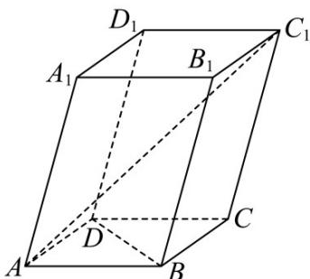

> [!faq]- 《专题01 空间向量及其运算（八大题型）（高效培优期中专项训练）数学人教A版2019高二选择性必修第一册》官方解析
>
> > [!success]- **【答案】** (1) $AC_{1}=a+b+c$ ， $\sqrt{10}$ ； (2)0.
>
> > [!note]- **【分析】**
> > （1）根据题意，利用空间向量的线性运算法则，得到 $AC_{1} = a + b + c$ ，再由向量数量积的运算公式和模的计算公式，求得 $\left|AC_1\right|$ 的值；
> >
> > (2) 根据题意，求得 $BD = b - a, AA_{1} = c$ ，利用数量积的计算公式，求得 $AA_{1} \cdot BD = 0$ ，进而求得 $\cos AA_{1}, BD$ 的值.
>
> > [!note]- **【解析】**
> > （1）解：因为 $AB = a, \overline{AD} = b, AA_1 = c$ ，且 $BC = AD, CC_1 = AA_1$
> >
> > 所以 $AC_{1} = AB + BC + CC_{1} = AB + AD + AA_{1} = a + b + c$
> >
> > 又因为底面 ABCD 是边长为 1 的正方形且 $AA_{1}=2,\angle A_{1}AB=\angle A_{1}AD=60^{\circ}$
> >
> > 所以 $\left|AC_{1}\right|=\sqrt{\left(a+b+c\right)^{2}}=\sqrt{a^{2}+b^{2}+c^{2}+2a\cdot b+2b\cdot c+2a\cdot c}$ $=\sqrt{1+1+4+0+2\times1\times2\times\frac{1}{2}+2\times1\times2\times\frac{1}{2}}=\sqrt{10}$
> >
> > (2) 解：因为底面 ABCD 是边长为 1 的正方形，且 $AA_{1}=2$ ， $\angle A_{1}AB=\angle A_{1}AD=60^{\circ}$
> >
> > 又由 $BD = AD - AB = b - a, AA_{1} = c$
> >
> > 所以 $AA_{1} \cdot BD = (b - a) \cdot c = c \cdot b - c \cdot a = 2 \times 1 \times \frac{1}{2} - 2 \times 1 \times \frac{1}{2} = 0$
> >
> > 所以 $\cos AA_{1}, BD = \frac{AA_{1} \cdot BD}{\left|AA_{1}\right|\left|BD\right|} = 0$ .
> >
> > 
