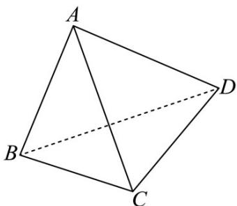

> [!faq]- 《专题01 空间向量及其运算（八大题型）（高效培优期中专项训练）数学人教A版2019高二选择性必修第一册》官方解析
>
> > [!success]- **【答案】** B
>
> > [!note]- **【分析】**
> > 利用基底法结合空间向量数量积的运算律可求 a 的值.
>
> > [!note]- **【解析】**
> > 设正四面体的棱长为 $a$ ·
> >
> > 
> >
> > 由正四面体结构性质可知 $\angle BAC = \angle CAD = \angle BAD = \frac{\pi}{3}$
> >
> > 而 $\left(AB + AC\right) \cdot \left(BC + BD\right) = \left(AB + AC\right) \cdot \left(AC - AB + AD - AB\right)$ $= \left(AB + AC\right) \cdot \left(AC + AD - 2AB\right)$ $= AB \cdot AC + AB \cdot AD - 2AB^2 + AC^2 + AC \cdot AD - 2AB \cdot AC$ $= \frac{1}{2}a^2 + \frac{1}{2}a^2 - 2a^2 + a^2 + \frac{1}{2}a^2 - 2 \times \frac{1}{2}a^2 = -\frac{a^2}{2} = -1$ 故 $a = \sqrt{2}$ ，
> >
> > 故选 **B**.
