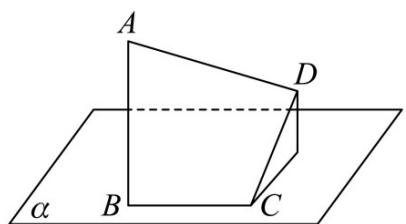
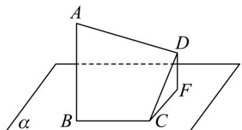

> [!faq]- 《专题01 空间向量及其运算（八大题型）（高效培优期中专项训练）数学人教A版2019高二选择性必修第一册》官方解析
>
> > [!success]- **【答案】** 
>
> > [!note]- **【分析】**
> > 由空间向量的线性运算可知 $AD = AB + BC + CD$ ，两边平方，再利用向量的数量积公式即可得解。
>
> > [!note]- **【解析】**
> > 设 $DF \perp$ 平面 $\alpha$ 于 F，
> >
> > QAB⊥平面α，
> >
> > $\therefore AB//DF$ ，又 CD 与平面 $\alpha$ 成 $30^{\circ}$ 角，
> >
> > $$
> > \because \angle D C F = 3 0 ^ {\circ}
> > $$
> >
> > ∴ AB 与 CD 的夹角为 $120^{\circ}$ ,
> >
> > 又 $QAB \perp$ 平面 $\alpha$ ， $BC \subset$ 平面 $\alpha$ ， $\therefore AB \perp BC$ ，
> >
> > 又 $CD \perp BC$
> >
> > $$
> > \therefore \left| A D \right| ^ {2} = \left(A B + B C + C D\right) ^ {2}
> > $$
> >
> > $$
> > = A B ^ {2} + B C ^ {2} + C D ^ {2} + 2 A B \cdot B C + 2 A B \cdot C D + 2 B C \cdot C D
> > $$
> >
> > $$
> > = 3 \times 2 ^ {2} + 2 \times \left(2 \times 2 \times 0 - 2 \times 2 \times \frac {1}{2} + 2 \times 2 \times 0\right) = 8,
> > $$
> >
> > $$
> > \therefore \left| \stackrel {\sqcup \sqcup \sqcup} {A D} \right| = 2 \sqrt {2}
> > $$
> >
> > 故答案为： $2\sqrt{2}$
> >
> > 
