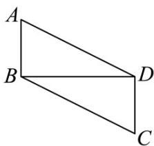
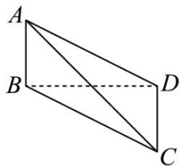

> [!faq]- 《专题01 空间向量及其运算（八大题型）（高效培优期中专项训练）数学人教A版2019高二选择性必修第一册》官方解析
>
> > [!success]- **【答案】**   A. $2\sqrt{2}$ B. $\sqrt{10}$ C. $2\sqrt{3}$ D. $\sqrt{13}$
>
> > [!note]- **【分析】**
> > 利用空间向量的线性运算及数量积公式计算模长即可·
>
> > [!note]- **【解析】**
> > 已知平行四边形 $ABCD$ ， $AB = \sqrt{3}$ ， $AD = \sqrt{7}$ 且 $AB \perp BD$
> >
> > $$
> > \therefore C D \perp B D, A B = C D = \sqrt {3}, B C = A D = \sqrt {7} \quad , B D = \sqrt {7 - 3} = 2
> > $$
> >
> > 二面角 $A - BD - C$ 为 $120^{\circ}$ ， $\therefore \cos \left\langle \overline{BA},\overline{DC}\right\rangle = -\frac{1}{2}$ ， $\therefore \cos \left\langle \overline{AB},\overline{DC}\right\rangle = \frac{1}{2}$ ， $\because \overline{AC} = \overline{AB} +\overline{BD} +\overline{DC}$
> >
> > $$
> > \therefore A C ^ {2} = \left(A B + B D + D C\right) ^ {2} = A B ^ {2} + B D ^ {2} + D C ^ {2} + 2 A B \cdot B D + 2 A B \cdot D C + 2 B D \cdot D C
> > $$
> >
> > $= 3 + 4 + 3 + 2 \times \sqrt{3} \times \sqrt{3} \times \frac{1}{2} = 13$
> >
> > 则 $\left|AC\right|=\sqrt{13}$ ，即A与C之间距离为 $\sqrt{13}$ ·
> >
> > 故选 **D**.
