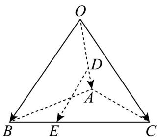

<!-- question-source:start -->
12. 如图，在三棱锥 $O - ABC$ 中，点 $D, E$ 分别在棱 $OA, BC$ 上，且 $\overline{OD} = \frac{2}{3} \overline{OA}, \overline{BE} = \frac{1}{3} \overline{BC}$ ，设 $\overline{OA} = a$ ， $\overline{OB} = b, \overline{OC} = c$ ，则 $\overline{DE} = (\quad)$

A. $-\frac{1}{3}a + \frac{2}{3}b + \frac{1}{3}c$ B. $-\frac{2}{3}a + \frac{2}{3}b + \frac{1}{3}c$ C. $-\frac{2}{3}a - \frac{2}{3}b + \frac{1}{3}c$ D. $-\frac{1}{3}a + \frac{1}{3}b + \frac{2}{3}c$
<!-- question-source:end -->

![[高中/课堂同步/题库/人教A版高中数学同步讲义(2026)/03_选择性必修第一册/期中专项训练+期中模拟卷/专题02 空间向量基本定理（三大题型）（高效培优期中专项训练）数学人教A版2019高二选择性必修第一册/专题02_空间向量基本定理_三大题型/questions/answers/Q00079124A1.md]]
