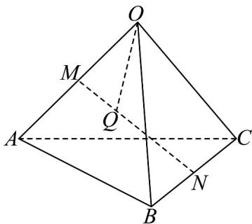

<!-- question-source:start -->
14．如图，M，N分别是四面体OABC的棱OA，BC的中点，Q是MN上靠近点M的三等分点，AO=a，
AB=b, AC=c.

(1)以 $\left\{\begin{array}{ccc}\mathrm{r}&\mathrm{r}&\mathrm{r}\\a,b,c\end{array}\right\}$ 为基表示 $\overline{OQ}$ ;

(2)若 $|a| = |b| = 1$ ， $|c| = \lambda$ ， $\angle OAB = \angle OAC = \frac{\pi}{3}$ ， $\angle CAB = \frac{\pi}{2}$ ，求 $|OQ|$ 的最小值。
<!-- question-source:end -->

![[高中/课堂同步/题库/人教A版高中数学同步讲义(2026)/03_选择性必修第一册/期中专项训练+期中模拟卷/专题02 空间向量基本定理（三大题型）（高效培优期中专项训练）数学人教A版2019高二选择性必修第一册/专题02_空间向量基本定理_三大题型/questions/answers/Q00079126A1.md]]
