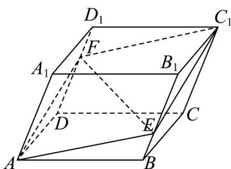

<!-- question-source:start -->
27. 如图所示，平行六面体 $ABCD - A_1B_1C_1D_1$ 中， $E, F$ 分别在 $B_1B$ 和 $D_1D$ 上， $BE = \frac{1}{3} BB_1$ ， $DF = \frac{2}{3} DD_1$ .

(1)求证： $A$ ， $E$ ， $C_1$ ， $F$ 四点共面；

(2)若 $EF = xAB + yAD + zAA_{1}$ ，求 $x + y + z$ 的值.
<!-- question-source:end -->

![[高中/课堂同步/题库/人教A版高中数学同步讲义(2026)/03_选择性必修第一册/期中专项训练+期中模拟卷/专题02 空间向量基本定理（三大题型）（高效培优期中专项训练）数学人教A版2019高二选择性必修第一册/专题02_空间向量基本定理_三大题型/questions/answers/Q00079138A1.md]]
