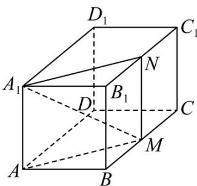

> [!faq]- 《专题02 空间向量基本定理（三大题型）（高效培优期中专项训练）数学人教A版2019高二选择性必修第一册》官方解析
>
> > [!success]- **【答案】** A. 点 $P$ 一定在平面 $AA_1C_1C$ 内 B. 当 $z = 2x$ 时，点 $P$ 的轨迹长度为 $\sqrt{3}$ C. 当 $A_1$ ， $P$ ， $M$ 三点共线时， $2x + z = 1$ D. 当 $PA \cdot PD = -\frac{1}{4}$ 时， $|PA_1|$ 的最大值为 $\frac{\sqrt{11}}{2}$
>
> > [!note]- **【分析】**
> > A利用 $\frac{AB}{2}+\frac{1}{2}AD=\frac{AM}{2}$ 及平面向量基本定理即可；B取 $B_{1}C_{1}$ 的中点N，即可得出 $AP=2xAN$ ，计算AN长度即可；C由共线性质即可；D利用 $\left\{\begin{aligned}&AB,AD,AA_{1}\end{aligned}\right\}$ 基底化简 $PA\cdot PD=-\frac{1}{4}$ 得出 $8x^{2}-4x+z^{2}=-\frac{1}{4}$ ，再化简得出 $\left|\overrightarrow{A_{1}P}\right|=\sqrt{4x-\frac{1}{4}+1-2z}$ ，当 $x=\frac{1}{2}$ ，z=0时， $\left|PA_{1}\right|$ 取最大值，但此时不满足 $8x^{2}-4x+z^{2}=-\frac{1}{4}$
>
> > [!note]- **【解析】**
> > 对于 A 选项，易得 $\overline{AB} + \frac{1}{2}\overline{AD} = \overline{AM}$ ，故 $\overline{AP} = 2x\overline{AM} + z\overline{AA_{1}}$ ，则 $\overline{AP}, \overline{AM}, \overline{AA_{1}}$ 共面，又
> >
> > $AP, AM, AA_{1}$ 有公共点 $A$ ，故点 $P$ 在平面 $AA_{1}M$ 内，故 $\mathsf{A}$ 错误；
> >
> > 对于 B 选项，取 $B_{1}C_{1}$ 的中点 N，连接 $A_{1}N, MN$ ，
> >
> > 则 $MN//BB_{1}, AA_{1}//BB_{1}$ ， $MN = BB_{1}, AA_{1} = BB_{1}$ ，则 $MN//AA_{1}$ ， $MN = AA_{1}$
> >
> > 则四边形 $AA_{1}NM$ 为平行四边形，
> >
> > 则当 $z = 2x$ 时， $\overline{AP} = 2x\overline{AM} + 2x\overline{AA}_1 = 2x\overline{AN}$ ， $x \in \left[0, \frac{1}{2}\right]$ ，
> >
> > 可知此时点 P 的轨迹为线段 AN，其长度为 $\sqrt{AA_{1}^{2} + BM^{2} + AB^{2}} = \sqrt{1 + 1 + 1} = \sqrt{3}$
> >
> > 故 $^{B}$ 正确；
> >
> > 对于 $C$ 选项，由 $\overline{AP} = 2x\overline{AM} + z\overline{AA}_1$ ，与 $A_{1},P,M$ 三点共线，可知 $2x + z = 1$ ，故 $C$ 正确；
> >
> > 对于 D 选项，显然 $\left\{AB, AD, AA_{1}\right\}$ 为一组正交基底，
> >
> > $$
> > \text {而} D P = A P - A D = 2 x A B + x A D + z A A _ {1} - A D = 2 x A B + (x - 1) A D + z A A _ {1}
> > $$
> >
> > $$
> > \cdot P A \cdot P D = A P \cdot D P = \left(2 x A B + x A D + z A A _ {1}\right) \cdot \left[ 2 x A B + (x - 1) A D + z A A _ {1} \right]
> > $$
> >
> > $$
> > = 4 x ^ {2} \overline {{A B}} ^ {2} + x (x - 1) \overline {{A D}} ^ {2} + z ^ {2} \overline {{A A _ {1}}} ^ {2} = 8 x ^ {2} - 4 x + z ^ {2} = - \frac {1}{4}
> > $$
> >
> > 而 $A_{1}P = AP - AA_{1} = 2xAB + xAD + (z - 1)AA_{1}$
> >
> > $$
> > \left| \begin{array}{c} \square \square \\ A _ {1} P \end{array} \right| = \sqrt {4 x ^ {2} A B ^ {2} + x ^ {2} A D ^ {2} + (z - 1) ^ {2}} \frac {\square \square \square}{A A _ {1} ^ {2}} = \sqrt {8 x ^ {2} + z ^ {2} - 2 z + 1} = \sqrt {4 x - \frac {1}{4} + 1 - 2 z}
> > $$
> >
> > 因 $x \in \left[0, \frac{1}{2}\right]$ ， $z \in [0, 1]$ ，故当 $x = \frac{1}{2}$ ， $z = 0$ 时， $\left|PA_1\right|$ 最大为 $\sqrt{2 - \frac{1}{4} + 1} = \frac{\sqrt{11}}{2}$
> >
> > 此时不满足 $8x^{2} - 4x + z^{2} = -\frac{1}{4}$ ，故 $\left|PA_{1}\right|$ 的最大值不为 $\frac{\sqrt{11}}{2}$ ，故D错误.
> >
> > 故选：BC.
> >
> > 
