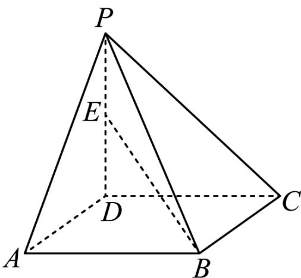
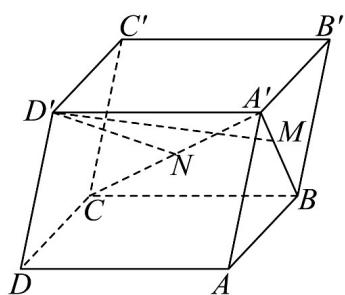
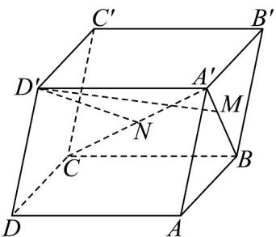

> [!faq]- 《专题02 空间向量基本定理（三大题型）（高效培优期中专项训练）数学人教A版2019高二选择性必修第一册》官方解析
>
> > [!success]- **【答案】** $-\frac{1}{2} / -0.5$ $\frac{1}{2} / 0.5$
>
> > [!note]- **【分析】**
> > 根据空间向量的线性运算即可求解·
>
> > [!note]- **【解析】**
> > （1）因为 $\overline{BE} = \overline{PE} - \overline{PB} = \frac{1}{2}\overline{PD} - \overline{PB} = \frac{1}{2}\left(\overline{PC} + \overline{CD}\right) - \overline{PB}$
> >
> > $$
> > = \frac {1}{2} \left(\stackrel {\square \square \square} {P C} + \stackrel {\square \square \square} {B A}\right) - \stackrel {\square \square \square} {P B} = \frac {1}{2} \left(\stackrel {\square \square \square} {P C} + \stackrel {\square \square \square} {P A} - \stackrel {\square \square \square} {P B}\right) - \stackrel {\square \square \square} {P B} = \frac {1}{2} \stackrel {\square \square \square} {P A} - \frac {3}{2} \stackrel {\square \square \square} {P B} + \frac {1}{2} \stackrel {\square \square \square} {P C} = \frac {1}{2} a - \frac {3}{2} b + \frac {1}{2} c,
> > $$
> >
> > 所以 $x = \frac{1}{2}$ ， $y = -\frac{3}{2}$ ， $z = \frac{1}{2}$ ，所以 $x + y + z = -\frac{1}{2}$
> >
> > (2) 因为 $\overline{PE} = \frac{1}{2} \overline{PD} = \frac{1}{2} \left( \overline{PA} + \overline{AD} \right) = \frac{1}{2} \left( \overline{PA} + \overline{BC} \right) = \frac{1}{2} \left( \overline{PA} + \overline{PC} - \overline{PB} \right) = \frac{1}{2} a - \frac{1}{2} b + \frac{1}{2} c$
> >
> > 所以 $x = \frac{1}{2}$ ， $y = -\frac{1}{2}$ ， $z = \frac{1}{2}$ ，所以 $x + y + z = \frac{1}{2}$
> >
> > 另解：
> >
> > 由 A, B, C, D 四点共面知， $PD = x'PA + y'PB + z'PC$ ，且 $x' + y' + z' = 1$ ，由 $PE = \frac{1}{2}PD$ 及等和面定理知， $x + y + z = \frac{1}{2}$ 。
> >
> > 
> >
> > 故答案为： $-\frac{1}{2}$ ; $\frac{1}{2}$
> >
> > 16. 四棱柱 $ABCD - A'B'C'D'$ 的六个面都是平行四边形，点 $M$ 在对角线 $A'B$ 上，且 $\left|A'M\right| = \frac{1}{2}\left|MB\right|$ ，点 $N$ 在对角线 $A'C$ 上，且 $\left|A'N\right| = \frac{1}{3}\left|NC\right|$ .
> >
> > 
> >
> > (1)设向量 $AB = a$ ， $AD = b$ ， $AA' = c$ ，用 $a$ 、 $b$ 、 $c$ 表示向量 $D'M$ 、 $D'N$ ；
> >
> > (2)求证： $M$ 、 $N$ 、 $D^{\Phi}$ 三点共线.
> >
> > 【答案】(1) $D^{\prime}M=\frac{1}{3}a-b-\frac{1}{3}c,\quad D^{\prime}N=\frac{1}{4}a-\frac{3}{4}b-\frac{1}{4}c$
> >
> > (2)证明见解析
> >
> > 【分析】（ $^{1}$ ）借助空间向量的线性运算计算即可得；
> >
> > (2) 借助向量共线定理证明 $MN \parallel MD'$ 即可得.
> >
> > 【详解】（1）因为 $\left|A'M\right|=\frac{1}{2}\left|MB\right|$ ，则 $A'M=\frac{1}{3}A'B=\frac{1}{3}\left(A'A+A'B'\right)=-\frac{1}{3}AA'+\frac{1}{3}AB$
> >
> > 
> >
> > 所以 $D^{\prime}M = D^{\prime}A^{\prime} + A^{\prime}M = -AD + \left(-\frac{1}{3}AA^{\prime} + \frac{1}{3}AB\right) = \frac{1}{3}a - b - \frac{1}{3}c$
> >
> > 又因为 $\left|A^{\prime}N\right|=\frac{1}{3}\left|NC\right|$ ，则 $A^{\prime}N=\frac{1}{4}A^{\prime}C=\frac{1}{4}\left(A^{\prime}A+AB+AD\right)$
> >
> > 所以 $D^{\prime}N = D^{\prime}A^{\prime} + A^{\prime}N = -AD + \frac{1}{4}\left(A^{\prime}A + AB + AD\right) = \frac{1}{4}AB - \frac{3}{4}AD - \frac{1}{4}AA'$ $= \frac{1}{4}a - \frac{3}{4}b - \frac{1}{4}c$ ;
> >
> > (2) 因为 $MN = A'N - A'M = \frac{1}{4} \left( -AA' + AB + AD \right) - \left( -\frac{1}{3} AA' + \frac{1}{3} AB \right)$
> >
> > $$
> > = \frac {1}{1 2} A A ^ {\prime} - \frac {1}{1 2} A B + \frac {1}{4} A D = - \frac {1}{1 2} a + \frac {1}{4} b + \frac {1}{1 2} c
> > $$
> >
> > $$
> > \begin{array}{l} \square \square \square \\ M D ^ {\prime} = A ^ {\prime} D ^ {\prime} - A ^ {\prime} M = A ^ {\prime} D ^ {\prime} - \left(- \frac {1}{3} A A ^ {\prime} + \frac {1}{3} A B\right) = - \frac {1}{3} a + b + \frac {1}{3} c \end{array} ,
> > $$
> >
> > 所以 $MN = \frac{1}{4} MD'$
> >
> > 所以 $MN$ 与 $MD'$ 共线，
> >
> > 因为这两个向量有公共点M，
> >
> > 所以 M 、 N 、 D 三点共线 .
