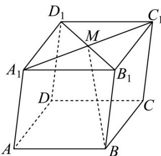

> [!faq]- 《专题02 空间向量基本定理（三大题型）（高效培优期中专项训练）数学人教A版2019高二选择性必修第一册》官方解析
>
> > [!success]- **【答案】** A. $-\frac{1}{2}a + \frac{1}{2}b + c$ B. $-\frac{1}{2}a + \frac{1}{2}b - c$ C. $-\frac{1}{2}a - \frac{1}{2}b + c$ D. $\frac{1}{2}a - \frac{1}{2}b + c$
>
> > [!note]- **【分析】**
> > 作图，然后根据空间向量基本定理求解即可·
>
> > [!note]- **【解析】**
> > 根据题意， $BM = BB_{1} + B_{1}M = AA_{1} + \frac{1}{2} BD = AA_{1} + \frac{1}{2}(AD - AB) = -\frac{1}{2}a + \frac{1}{2}b - c$ 故选：B.
> >
> > 
