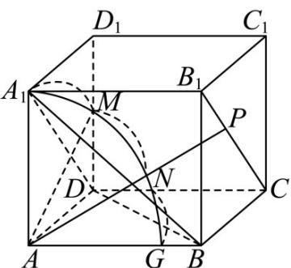

> [!faq]- 《专题02 空间向量基本定理（三大题型）（高效培优期中专项训练）数学人教A版2019高二选择性必修第一册》官方解析
>
> > [!success]- **【答案】** A. 若 $x = 1$ ，则点 $P$ 在平面 $DCC_{1}D_{1}$ 上 B．若 y=1 ，且 $x+z=1$ ，则 $_{AP}$ 与面 $ADD_{1}A_{1}$ 所成角最小值的正切值为 $\frac{\sqrt{21}}{2}$ C. 若 $x + y + z = 1$ ，则 $_{AP}$ 的最小值为 $\frac{2\sqrt{6}}{25}$ D．若 $AP = 4$ ，且 $P$ 在长方体表面上，则 $P$ 的轨迹长度为 $\frac{17}{3}\pi$
>
> > [!note]- **【分析】**
> > 对于 A，当 x=1 时，可得 $DP=yDC+zDD_{1}$ ，可判断 A； $B_{1}C//$ 平面 $ADD_{1}A_{1}$ ，可得 AP 的值最大时，AP 与面 $ADD_{1}A_{1}$ 所成角最小，可判断 B；利用等体积法可求得最小值判断 C；求得轨迹长可判断 D.
>
> > [!note]- **【解析】**
> > 对于 $A$ ，当 $x = 1$ 时，可得 $\overline{AP} = \overline{AD} + y\overline{AB} + z\overline{AA}_1$ ，所以 $\overline{DP} = y\overline{DC} + z\overline{DD}_1$
> >
> > 所以点 P 在平面 $DCC_{1}D_{1}$ 上，故 A 正确；
> >
> > 对于 B，因为 $A_{1}B_{1} // AB // DC$ ，且 $A_{1}B_{1} = AB = DC$
> >
> > 所以四边形 $A_{1}B_{1}CD$ 是平行四边形，所以 $A_{1}D // B_{1}C$
> >
> > 又 $A_{1}D \subset$ 平面 $ADD_{1}A_{1}$ ， $B_{1}C \notin$ 平面 $ADD_{1}A_{1}$ ，所以 $B_{1}C //$ 平面 $ADD_{1}A_{1}$
> >
> > 又 $y = 1$ ，且 $x + z = 1$ 时，点 $P$ 在直线 $B_{1}C$ 上， $P$ 到平面 $ADD_{1}A_{1}$ 的距离为定值，
> >
> > 要使 $AP$ 与面 $ADD_{1}A_{1}$ 所成角最小，则 $AP$ 的值最大，由题意 $x, z \in \mathbb{R}$
> >
> > 故 $AP \to +\infty$ ，直线 $AP$ 与 $ADD_{1}A_{1}$ 所成角无限趋于零，故正切值无限趋于零，故 $^{B}$ 错误；
> >
> > 
> >
> > 当 $x + y + z = 1$ 时，点 P 在平面 $A_{1}BD$ 内，AP 的最小值即为点 A 到平面 $A_{1}BD$ 的距离，由勾股定理可得 $A_{1}B = \sqrt{AB^{2} + AA_{1}^{2}} = 2\sqrt{13}$ ， $A_{1}D = \sqrt{AD^{2} + AA_{1}^{2}} = 2\sqrt{7}$ ，
> >
> > $$
> > B D = \sqrt {A B ^ {2} + A D ^ {2}} = 4 \sqrt {3}
> > $$
> >
> > 由余弦定理可得 $\cos\angle A_{1}DB=\frac{DB^{2}+DA_{1}^{2}-BA_{1}^{2}}{2DB\cdot DA_{1}}=\frac{48+28-52}{2\times4\sqrt{3}\times2\sqrt{7}}=\frac{\sqrt{3}}{2\sqrt{7}}$
> >
> > 所以 $\sin \angle A_{1}DB = \frac{5}{2\sqrt{7}}$ ，所以 $S_{\triangle A_1DB} = \frac{1}{2}\times 4\sqrt{3}\times 2\sqrt{7}\times \frac{5}{2\sqrt{7}} = 10\sqrt{3}$
> >
> > 设 A 到平面 $A_{1}BD$ 的距离为 d，由 $V_{A-A_{1}BD}=V_{A_{1}-ABD}$
> >
> > 得 $\frac{1}{3} S_{\triangle A_1DB}\cdot d = \frac{1}{3} S_{\triangle ADB}\cdot AA_1$ ，所以 $\frac{1}{3}\times 10\sqrt{3} d = \frac{1}{3}\times \frac{1}{2}\times 6\times 2\sqrt{3}\times 4$
> >
> > 解得 $d = \frac{12}{5}$ ，故C错误；
> >
> > 当 $AP = 4$ ，即 $P$ 在表面 $ADD_{1}A_{1}$ 内的轨迹是以 $A$ 为圆心， $^{4}$ 为半径的一段圆组弧，
> >
> > 圆弧交 $DD_{1}$ 于点 $M$ ，可得 $\cos \angle MAD = \frac{2\sqrt{3}}{4} = \frac{\sqrt{3}}{2}$ ，所以 $\angle MAD = \frac{\pi}{6}$
> >
> > 所以 $\overline{AM} = \frac{1}{6} \times 2\pi \times 4 = \frac{4\pi}{3}$ ，所以 DM = 2，
> >
> > 当 $P$ 在表面 $CDD_{1}C_{1}$ 内时，由 $DP^{2} = AP^{2} - AD^{2} = 4$ ，所以 $P$ 的轨迹是以 $D$ 为圆心，
> >
> > $^{2}$ 为半径的圆的 $\frac{1}{4}$ ，所以轨迹长度为 $\pi$
> >
> > 在平面 ABCD 内的轨迹与在 $ADD_{1}A_{1}$ 内的相同为 $\frac{4\pi}{3}$ ,
> >
> > 在平面 $BAA_{1}B_{1}$ 内轨迹是以 A 为圆心， $^{4}$ 为半径的圆的 $\frac{1}{4}$ ，所以轨迹长度为 $2\pi$ ，
> >
> > 所以若 $AP = 4$ ，且 $P$ 在长方体表面上，则 $P$ 的轨迹长度为 $\frac{4}{3}\pi +\frac{4}{3}\pi +2\pi +\pi = \frac{17}{3}\pi$ ，故D正确.故选：AD.
> >
> > ## 考点 03 空间向量基本定理及其应用
