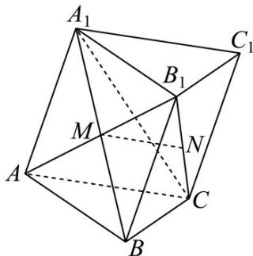
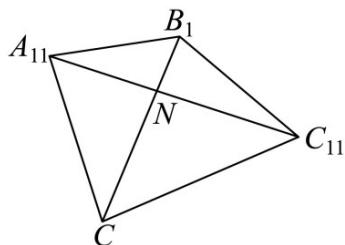

> [!faq]- 《专题02 空间向量基本定理（三大题型）（高效培优期中专项训练）数学人教A版2019高二选择性必修第一册》官方解析
>
> > [!success]- **【答案】** A. 四边形 $BCC_{1}B_{1}$ 是矩形 B. 若 $N$ 是 $B_{1}C$ 的中点，则 $MN//$ 平面 $ABC$ C. 点 $A$ 到平面 $A_{1}BC$ 的距离为 1 D. $A_{1}N + NC_{1}$ 的最小值为 $\sqrt{\frac{16 + 4\sqrt{11}}{5}}$
>
> > [!note]- **【分析】**
> > 由题可得 $\angle BAC = \angle BAA_{1} = \angle A_{1}AC = 60^{\circ}$ ，以 AB，AC， $AA_{1}$ 为基底，根据 $CC_{1} = AA_{1}$ ， $BC = AC - AB$ ，可得 $CC_{1} \cdot BC \neq 0$ ，即可判断选项 A；由 $B_{1}C = AC - AB - AA_{1}$ 可得 $B_{1}C = \sqrt{5}$ ，再由将平面 $C_{1}B_{1}C$ 沿着 $B_{1}C$ 展开，使平面 $C_{1}B_{1}C$ 与 $A_{1}B_{1}C$ 共面，则在四边形 $A_{11}B_{1}C_{11}C$ 中， $A_{1}N + NC_{1}$ 的最小值为 $A_{11}C_{11}$ ，根据余弦定理求 $A_{11}C_{11}$ ，即可判断选项 D；若 N 是 $B_{1}C$ 的中点，根据线面平行判定定理即可判断选项 B，由 $AB \perp$ 平面 $A_{1}BC$ ，所以点 A 到平面 $A_{1}BC$ 的距离为 AB = 1，即可判断选项 C.
>
> > [!note]- **【解析】**
> > 如图，
> >
> > 
> >
> > 在三棱柱 $ABC-A_{1}B_{1}C_{1}$ 中， $ABB_{1}A_{1}$ 为平行四边形，因为 M 为线段 $A_{1}B$ 的中点，
> >
> > 所以 M 为线段 $AB_{1}$ 的中点，若 N 是 $B_{1}C$ 的中点，则在 $\triangle AB_{1}C$ 中 MN//AC，
> >
> > 因为 $MN \notin$ 平面 $ABC$ ， $AC \subset$ 平面 $ABC$ ，所以 $MN //$ 平面 $ABC$ ，所以 $^B$ 正确；
> >
> > 因为 $AB = 1$ ， $A_{1}B = BC = \sqrt{3}$ ， $AA_{1} = AC = 2$ ，所以 $AB^{2} + BC^{2} = AC^{2}$ ， $AB^{2} + BA_{1}^{2} = AA_{1}^{2}$
> >
> > 所以 $AB \perp BC$ ， $AB \perp BA_{1}$ ，因为 $BC \subset \text{平面 } A_{1}BC$ ， $BA_{1} \subset \text{平面 } A_{1}BC$ ， $BC \cap BA_{1} = B$
> >
> > 所以 $AB \perp$ 平面 $A_{1}BC$ ，所以点 A 到平面 $A_{1}BC$ 的距离为 AB = 1，所以 C 正确；
> >
> > 由上可知 $\angle BAC = 60^{\circ}$ ， $\angle BAA_{1} = 60^{\circ}$ ，又 $\angle A_{1}AC = 60^{\circ}$ ， $CC_{1} = AA_{1}$ ， $BC = AC - AB$
> >
> > $$
> > C C _ {1} \cdot B C = A A _ {1} \cdot \left(A C - A B\right) = A A _ {1} \cdot A C - A A _ {1} \cdot A B = 2 \times 2 \times \cos 6 0 ^ {\circ} - 2 \times 1 \times \cos 6 0 ^ {\circ} = 1 \neq 0
> > $$
> >
> > 所以 BC 与 $CC_{1}$ 不垂直，所以 A 错误；
> >
> > $$
> > B _ {1} C = A C - A B _ {1} = A C - A B - A A _ {1}
> > $$
> >
> > 所以 $\overline{B_{1}C^{2}}=\left(\overline{AC}-\overline{AB}-\overline{AA_{1}}\right)^{2}=\overline{AC^{2}}+\overline{AB^{2}}+\overline{AA_{1}^{2}}-2\overline{AC}\cdot\overline{AB}-2\overline{AC}\cdot\overline{AA_{1}}+2\overline{AB}\cdot\overline{AA_{1}}$
> >
> > $$
> > = 4 + 1 + 4 - 2 \times 2 \times 1 \times \cos 6 0 ^ {\circ} - 2 \times 2 \times 2 \times \cos 6 0 ^ {\circ} + 2 \times 2 \times 1 \times \cos 6 0 ^ {\circ} = 5
> > $$
> >
> > 所以 $B_{1}C = \sqrt{5}$ ，设 $\angle A_1B_1C = \alpha$ ， $\angle C_1B_1C = \beta$
> >
> > 则在 $\triangle A_{1}B_{1}C$ 中，由余弦定理知 $\cos \alpha = \frac{1 + 5 - 4}{2\times 1\times\sqrt{5}} = \frac{\sqrt{5}}{5}$ ，所以 $\sin \alpha = \frac{2\sqrt{5}}{5}$
> >
> > 在 $\triangle C_{1}B_{1}C$ 中，由余弦定理知 $\cos \beta = \frac{3 + 5 - 4}{2\times\sqrt{3}\times\sqrt{5}} = \frac{2\sqrt{15}}{15}$ ，所以 $\sin \beta = \frac{\sqrt{165}}{15}$
> >
> > 将平面 $C_1B_1C$ 沿着 $B_{1}C$ 展开，使平面 $C_1B_1C$ 与 $A_{1}B_{1}C$ 共面，如图：
> >
> > 
> >
> > 在四边形 $A_{11}B_{1}C_{11}C$ 中，则 $\angle A_{11}B_{1}C_{11} = \alpha + \beta$
> >
> > $$
> > \cos (\alpha + \beta) = \cos \alpha \cos \beta - \sin \alpha \sin \beta = \frac {\sqrt {5}}{5} \times \frac {2 \sqrt {1 5}}{1 5} - \frac {2 \sqrt {5}}{5} \times \frac {\sqrt {1 6 5}}{1 5} = \frac {2 \sqrt {3} (1 - \sqrt {1 1})}{1 5}
> > $$
> >
> > $A_{1}N + NC_{1}$ 的最小值为 $A_{11}C_{11}$ ，在 $\triangle A_{11}B_{1}C_{11}$ 中，余弦定理得
> >
> > $$
> > A _ {1 1} C _ {1 1} ^ {2} = A _ {1 1} B _ {1} ^ {2} + B _ {1} C _ {1 1} ^ {2} - 2 A _ {1 1} B _ {1} \cdot B _ {1} C _ {1 1} \cdot \cos (\alpha + \beta) = 1 + 3 - 2 \times 1 \times \sqrt {3} \times \frac {2 \sqrt {3} (1 - \sqrt {1 1})}{1 5} = \frac {1 6 + 4 \sqrt {1 1}}{5}
> > $$
> >
> > 所以 $A_{1}N + NC_{1}$ 的最小值为 $A_{11}C_{11} = \sqrt{\frac{16 + 4\sqrt{11}}{5}}$ ，所以 D 正确.
> >
> > 故选 **BCD**
