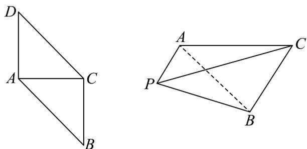

> [!faq]- 《专题02 空间向量基本定理（三大题型）（高效培优期中专项训练）数学人教A版2019高二选择性必修第一册》官方解析
>
> > [!success]- **【答案】** 
>
> > [!note]- **【分析】**
> > 利用空间向量，将二面角 $P - AC - B$ 的大小用 $\langle AP, CB \rangle$ 表示，将条件和目标都用 $PA, AC, CB$ 表示，再运用向量数量积求模长即可。
>
> > [!note]- **【解析】**
> > 因为二面角 $P - AC - B$ 的大小为 $\frac{\pi}{3}$ ，所以 $\langle PA, CB \rangle = \frac{2\pi}{3}$
> >
> > 又 $\left\langle PA, AC \right\rangle = \left\langle AC, CB \right\rangle = \frac{\pi}{2}$ 且 $PB = PA + AC + CB$
> >
> > 所以 $PB^{2} = \left( PA + AC + CB \right)^{2} = PA^{2} + AC^{2} + CB^{2} + 2PA \cdot AC + 2AC \cdot CB + 2CB \cdot PA$
> >
> > $$
> > = 3 + 2 C B \cdot P A = 3 + 2 \times 1 \times 1 \times \left(- \frac {1}{2}\right) = 2
> > $$
> >
> > 所以 $PB = \sqrt{2}$ .
> >
> > 故答案为： $\sqrt{2}$
