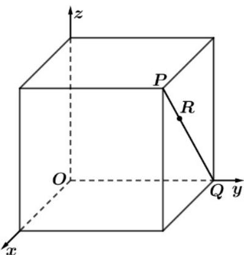

> [!faq]- 《专题03 空间向量及其运算的坐标表示（五大题型）（高效培优期中专项训练）数学人教A版2019高二选择性必修第一册》官方解析
>
> > [!success]- **【答案】**  A. $\left(\frac{2}{3}, 2, \frac{4}{3}\right)$ B. $\left(\frac{1}{3}, 2, \frac{1}{3}\right)$ C. $(1, 2, 1)$ D. $\left(\frac{4}{3}, 2, \frac{4}{3}\right)$
>
> > [!note]- **【分析】**
> > 由题意，得到 $P(2,2,2)$ ， $Q(0,2,0)$ ，再利用向量线性关系求解.
>
> > [!note]- **【解析】**
> > 由题意， $P(2,2,2)$ ， $Q(0,2,0)$ ，所以 $PQ = (-2,0,-2)$ ， $PR = \frac{1}{3}PQ = \left(-\frac{2}{3},0,-\frac{2}{3}\right)$ ，所以 $R\left(\frac{4}{3},2,\frac{4}{3}\right)$ .
> >
> > 故选 **D**
