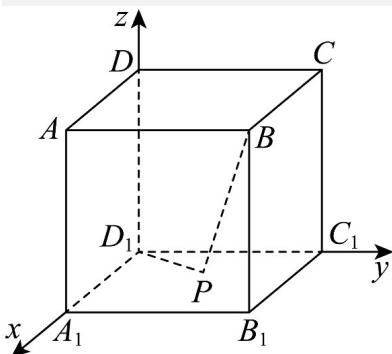

> [!faq]- 《专题03 空间向量及其运算的坐标表示（五大题型）（高效培优期中专项训练）数学人教A版2019高二选择性必修第一册》官方解析
>
> > [!success]- **【答案】** A. $-\frac{1}{2}$ B. 0 C. $-\frac{1}{4}$ D. -1
>
> > [!note]- **【分析】**
> > 建立空间直角坐标系，将向量 $PB, PD_{1}$ 用坐标表示，计算数量积，求最小值·【详解】
>
> > [!note]- **【解析】**
> > 
> > 如图，以 $D_{1}A_{1}$ ， $D_{1}C_{1}$ ， $D_{1}D$ 分别为 $x, y, z$ 轴建立空间直角坐标系，设点 $P(x,y,0)$ ， $0 \leq x \leq 1$ ， $0 \leq y \leq 1$ ， $B(1,1,1), D_{1}(0,0,0)$ 则 $\vec{PB} = (1 - x, 1 - y, 1)$ ， $\vec{PD}_{1} = (-x, -y, 0)$ ，当 $x = \frac{1}{2}, y = \frac{1}{2}$ 时， $\vec{PB} \cdot \vec{PD}_{1}$ 的最小，最小值为 $-\frac{1}{2}$ 。
> >
> > 故选 **A**.
