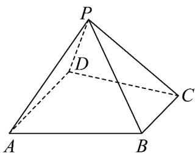
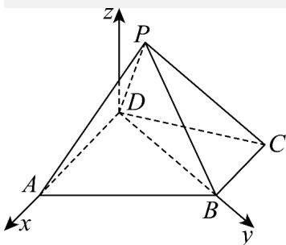

> [!faq]- 《专题03 空间向量及其运算的坐标表示（五大题型）（高效培优期中专项训练）数学人教A版2019高二选择性必修第一册》官方解析
>
> > [!success]- **【答案】**  $$ \left(0, \sqrt {3}\right) \cup \left(3, 2 \sqrt {3}\right) $$ $$ \left(1, \sqrt {3}\right) $$ $$ \left(0, 2 \sqrt {3}\right) \cup \left(3 \sqrt {3}, + \infty\right) $$ $$ \left(3, 2 \sqrt {3}\right) $$
>
> > [!note]- **【分析】**
> > 建立空间直角坐标系， $\left|PA\right|$ 表示关于坐标的函数，再求函数的值域。
>
> > [!note]- **【解析】**
> > 连接 BD，在△BCD 中，易得 $BD = \sqrt{3}$ ， $BD \perp BC$ 。
> > 以点 D 为坐标原点，以 DA, DB 所在直线为 x 轴、y 轴建立空间直角坐标系，
> >
> > 
> >
> > 则 $D(0,0,0)$ ， $A(2,0,0)$ ， $B(0,\sqrt{3},0)$ ， $C(-1,\sqrt{3},0)$ ， $P(x,y,z)$ ， $|PA|=\sqrt{(x-2)^{2}+y^{2}+z^{2}}$ 。
> >
> > 设平面 $PAD \cap$ 平面 PBC=l，因为 $AD \parallel BC$ ， $AD \not\subset$ 平面 PBC， $BC \subset$ 平面 PBC，
> >
> > 所以 $AD \parallel$ 平面 PBC，又因为平面 $PAD \cap$ 平面 PBC=l，所以 $AD \parallel l$ ，
> >
> > 当 x=0 时，可得点 P 在 yoz 平面内，可得 $AD \perp PD$ ， $AD \perp PB$ ，
> >
> > 又 $AD \parallel l$ ，所以 $l \perp PD$ ， $l \perp PB$ ，所以 $\angle DPB$ 即为平面 $PAD$ 与平面 $PBC$ 所成角的平面角，又因为平面 $PAD \perp$ 平面 $PBC$ ，所以 $\angle DPB = 90^\circ$ ，所以 $PD \perp PB$ ， $\therefore y^2 - \sqrt{3}y + z^2 = 0$ 。又因为 $PA \perp PC$ ， $\overline{AP} \cdot \overline{CP} = 0$ ，即 $x^2 - x - 2 + y^2 - \sqrt{3}y + z^2 = 0$ 。 $x^2 - x - 2 = 0$ ，当 $x = 2$ 时， $|PA| = \sqrt{y^2 + z^2} = \sqrt{\sqrt{3}y} \in (0, \sqrt{3})$ ，其中 $0 < y < \sqrt{3}$ ；当 $x = -1$ 时， $|PA| = \sqrt{9 + y^2 + z^2} = \sqrt{9 + \sqrt{3}y} \in (3, 2\sqrt{3})$ ，其中 $0 < y < \sqrt{3}$ ； $\therefore |PA|$ 的取值范围为 $(0, \sqrt{3}) \cup (3, 2\sqrt{3})$ ，
> >
> > 故选 **A**.
