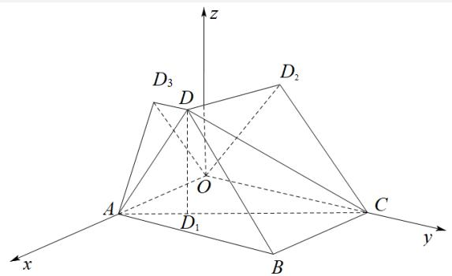

> [!faq]- 《专题03 空间向量及其运算的坐标表示（五大题型）（高效培优期中专项训练）数学人教A版2019高二选择性必修第一册》官方解析
>
> > [!success]- **【答案】** A. $S_2 < S_1 < S_3$ B. $S_3 < S_1 < S_2$ C. $S_3 < S_2 < S_1$ D. $S_1 < S_3 < S_2$
>
> > [!note]- **【分析】**
> > 求点 $D$ 在 $xOy, yOz, zOx$ 坐标平面上的正投影，进而可求 $S_{1}$ ， $S_{2}, S_{3}$ ，即可比较大小。【详解】由题意可知：点 $D$ 在 $xOy, yOz, zOx$ 坐标平面上的正投影分别为 $D_{1}\left(\frac{3}{2}, 1, 0\right), D_{2}\left(0, 1, 2\sqrt{2}\right), D_{3}\left(\frac{3}{2}, 0, 2\sqrt{2}\right)$ ，
>
> > [!note]- **【解析】**
> > 
> > 因为 $\overset{\text{UUUR}}{AD_1} = \left(-\frac{1}{2}, 1, 0\right), \overset{\text{UUUM}}{AC} = (-2, 4, 0)$ ，则 $\overset{\text{UUUM}}{AC} = 4\overset{\text{UUUM}}{AD_1}$ ，可知 $A, D_1, C$ 三点共线，
> > 可得 $S_{1} = S_{\triangle ABC} = \frac{1}{2}\times 2\times 4 = 4$ ， $S_{2} = S_{\triangle OCD_{2}} = \frac{1}{2}\times 4\times 2\sqrt{2} = 4\sqrt{2}$ ， $S_{3} = S_{\triangle OAD_{2}} = \frac{1}{2}\times 2\times 2\sqrt{2} = 2\sqrt{2}$ 所以 $S_{3} <   S_{1} <   S_{2}$
> >
> > 故选 **B**.
