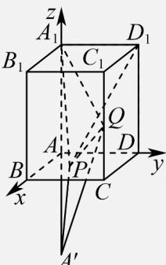
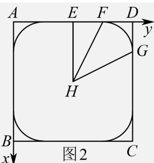

> [!faq]- 《专题03 空间向量及其运算的坐标表示（五大题型）（高效培优期中专项训练）数学人教A版2019高二选择性必修第一册》官方解析
>
> > [!success]- **【答案】** ABD
>
> > [!note]- **【分析】**
> > 由题意分析可知：点P为底面ABCD内一点（包含边界），建系，设 $P(x,y,0)(0\leq x\leq1,0\leq y\leq1)$ .
> >
> > 对于甲丙丁：结合向量垂直的坐标表示运算求解；对于乙：取点 $A_{1}$ 关于平面ABCD的对称点为 $A'$ ，连接 $A'Q,A'P$ ，结合对称性分析判断.
>
> > [!note]- **【解析】**
> > 以A为坐标原点， $AB,AD,AA_{1}$ 所在直线分别为x轴、y轴、z轴，建立如图1所示的空间直角坐标系，
> >
> > 因为 $A_{1}P = AP - AA_{1} = \lambda AB + \mu AD - AA_{1},\lambda ,\mu \in [0,1]$ 可得 $AP = \lambda AB + \mu AD,\lambda ,\mu \in [0,1]$ ，所以点P为底面ABCD内一点（包含边界），
> >
> > 则 $A_{1}(0,0,2),Q(1,1,2m),D_{1}(0,1,2)$ ，设 $P(x,y,0)(0\leq x\leq1,0\leq y\leq1)$ 对于甲同学，当 $m = \frac{1}{8}$ 时， $Q\left(1,1,\frac{1}{4}\right)$ ，则 $A_{1}P = (x,y,-2)$ ， $QP = (x-1,y-1,-\frac{1}{4})$ 若 $A_{1}P\perp QP$ ，则 $x(x-1)+y(y-1)+\frac{1}{2}=0$ ，整理得 $\left(x-\frac{1}{2}\right)^{2}+\left(y-\frac{1}{2}\right)^{2}=0$ 得 $x=y=\frac{1}{2}$ ，则点P存在，此时 $\lambda=\mu=\frac{1}{2}$ ，所以存在 $\lambda,\mu$ ，使得 $A_{1}P\perp QP$ ，故选项A正确，
> >
> > 对于乙同学，当 $m=\frac{1}{2}$ 时， $Q(1,1,1)$ ，点 $A_{1}$ 关于平面ABCD的对称点为 $A'(0,0,-2)$ 连接 $A'Q,A'P$ ，则 $A'P=A_{1}P$
> >
> > 
> > 图1
> >
> > 所以 $\left|A_{1}P\right|+\left|PQ\right|=A^{\prime}P+PQ\quad\left|A^{\prime}Q\right|=\sqrt{1^{2}+1^{2}+3^{2}}=\sqrt{11}$ 所以存在点 P，使得 $\left|A_{1}P\right|+\left|PQ\right|=2\sqrt{3}$ ，即存在 $\lambda,\mu$ ，使得 $\left|A_{1}P\right|+\left|PQ\right|=2\sqrt{3}$ ，故 B 正确，
> >
> > 对于丙同学，当 $m=\frac{7}{8}$ 时， $Q\left(1,1,\frac{7}{4}\right)$ ，可得 $D_{1}P=(x,y-1,-2)$ ， $A_{1}Q=\left(1,1,-\frac{1}{4}\right)$ ，
> >
> > 由 $D_{1}P\perp A_{1}Q$ ，得 $x+y-1+(-2)\times\left(-\frac{1}{4}\right)=0$ ，即 $x+y=\frac{1}{2}(0\leq x\leq1,0\leq y\leq1)$ ，
> >
> > 所以点 P 的轨迹为 $\triangle ABD$ 中平行于边 BD 的中位线，
> >
> > 当 P 为该中位线的中点时， $\lambda=\mu$ ，当 P 不为该中位线的中点时， $\lambda\neq\mu$ ，故 C 错误；
> >
> > 对于丁同学，当 $m=\frac{1}{24}$ 时， $Q\left(1,1,\frac{1}{12}\right)$ ，
> >
> > 可得 $A_{1}P=(x,y,-2)$ ， $QP=\left(x-1,y-1,-\frac{1}{12}\right)$ ，
> >
> > 由 $A_{1}P\perp QP$ ，得 $x(x-1)+y(y-1)+\frac{1}{6}=0$ ，整理得 $\left(x-\frac{1}{2}\right)^{2}+\left(y-\frac{1}{2}\right)^{2}=\frac{1}{3}$ ，
> >
> > 所以点 P 的轨迹为以 $H\left(\frac{1}{2},\frac{1}{2}\right)$ 为圆心， $\frac{\sqrt{3}}{3}$ 为半径的圆与正方形 ABCD 相交的圆弧，如图 2
> >
> > 取 中点，连接，因为 $|HE|=\frac{1}{2},|HF|=\frac{\sqrt{3}}{3}$ ，则 $\cos\angle EHF=\frac{\frac{1}{2}}{\frac{\sqrt{3}}{3}}=\frac{\sqrt{3}}{2}$ ，
> >
> > 所以 $\angle EHF=\frac{\pi}{6}$ ，由圆与正方形的对称性知， $\angle FHG=\frac{\pi}{2}-\frac{\pi}{3}=\frac{\pi}{6}$ ，
> >
> > 所以 $F_{G}=\frac{\sqrt{3}}{3}\times\frac{\pi}{6}=\frac{\sqrt{3}\pi}{18}$ ，故点 P 的轨迹长度为 $L=\frac{\sqrt{3}\pi}{18}\times4=\frac{2\sqrt{3}\pi}{9}$ ，所以选项 D 正确，
> >
> > $$
> > 2
> > $$
> >
> > 
> >
> > 故选 **ABD**.
