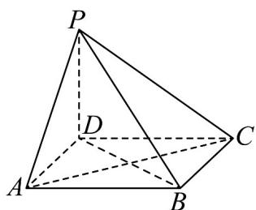

<!-- question-source:start -->
9. 如图，在四棱锥 $P - ABCD$ 中，底面 $ABCD$ 为正方形， $PD \perp$ 平面 $ABCD$ ， $AD = PD$

(1)求证： $AC\perp$ 平面PBD；

(2)求平面 $APB$ 的一个法向量.
<!-- question-source:end -->

![[高中/课堂同步/题库/人教A版高中数学同步讲义(2026)/03_选择性必修第一册/期中专项训练+期中模拟卷/专题04 空间向量的应用（五大题型）（高效培优期中专项训练）数学人教A版2019高二选择性必修第一册/专题04_空间向量的应用_五大题型/questions/answers/Q00079195A1.md]]
