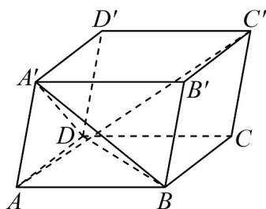

<!-- question-source:start -->
22. 如图，在平行六面体 $ABCD - A'B'C'D'$ 中， $\angle BAD = \angle BAA' = \angle DAA'$ ， $AB = AD = AA'$ 。设 $AB = a$ ， $\overline{AD} = b$ ， $\overline{AA'} = c$ 。

(1)用基底 $\left\{\begin{array}{cc}r & r \\ a, & b, & c\end{array}\right\}$ 表示向量 $AC'$ ;

(2)求异面直线 $AC'$ 与 BD 所成的夹角；

(3)证明： $AC' \perp$ 平面 $A^{\prime}BD$
<!-- question-source:end -->

![[高中/课堂同步/题库/人教A版高中数学同步讲义(2026)/03_选择性必修第一册/期中专项训练+期中模拟卷/专题04 空间向量的应用（五大题型）（高效培优期中专项训练）数学人教A版2019高二选择性必修第一册/专题04_空间向量的应用_五大题型/questions/answers/Q00079208A1.md]]
