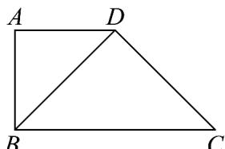
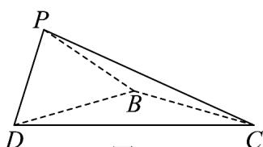

<!-- question-source:start -->
33. 如图 1，在梯形 ABCD 中， $AB \parallel DC$ ， $AB \perp AD$ ， $AB = AD = \frac{1}{2}DC = 2$ 。将 $\triangle ABD$ 沿 BD 折起到 $\triangle PBD$ 的位置，如图 2，记二面角 P-BD-C 的平面角为 $\theta$ 。

图1

图2

(1)若 $\theta = 90^{\circ}$ ，求 $PB$ 与平面 $PCD$ 所成角的余弦值；

(2)若 $\theta = 120^{\circ}$ ，求平面 $PBC$ 与平面 $PCD$ 夹角的余弦值；

(3)若点 $B$ 到平面 $PCD$ 的距离为 $\sqrt{3}$ ，求 $\cos \theta$
<!-- question-source:end -->

![[高中/课堂同步/题库/人教A版高中数学同步讲义(2026)/03_选择性必修第一册/期中专项训练+期中模拟卷/专题04 空间向量的应用（五大题型）（高效培优期中专项训练）数学人教A版2019高二选择性必修第一册/专题04_空间向量的应用_五大题型/questions/answers/Q00079219A1.md]]
