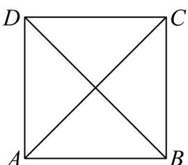
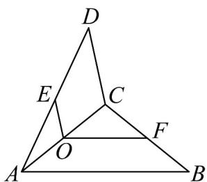
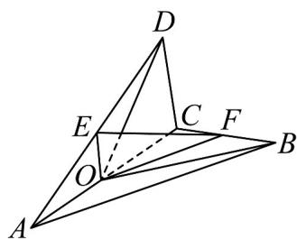

<!-- question-source:start -->
40．如图， $O$ 是正方形ABCD的中心，把正方形ABCD沿对角线 $AC$ 折成二面角 $B - AC - D$ ， $E$ ， $F$ 分别为 $AD$ ， $BC$ 的中点，

图1

图2

(1)当折成直二面角时（图 $^{1}$ ），求直线OE与OF所成角的大小；

(2)当折成二面角 B-AC-D 的平面角为 $60^{\circ}$ （图 2），求直线 BD 与平面 OEF 所成角的正弦值。
<!-- question-source:end -->

![[高中/课堂同步/题库/人教A版高中数学同步讲义(2026)/03_选择性必修第一册/期中专项训练+期中模拟卷/专题04 空间向量的应用（五大题型）（高效培优期中专项训练）数学人教A版2019高二选择性必修第一册/专题04_空间向量的应用_五大题型/questions/answers/Q00079225A1.md]]
