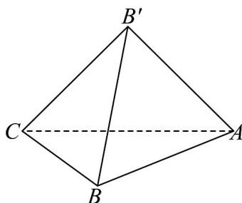

<!-- question-source:start -->
49. 如图，将等腰直角 $VABC$ 沿斜边 $AC$ 旋转，使得 $B$ 到达 $B'$ 的位置，且 $BB' = AB$ .

(1)证明：平面 $AB^{\prime}C \perp$ 平面 $ABC$ ；

(2)若在棱 $CB'$ 上存在点 $M$ ，使得 $\overline{CM} = \mu \overline{CB'}$ ， $\mu \in \left[\frac{1}{5}, \frac{4}{5}\right]$ ，在棱 $BB'$ 上存在点 $N$ ，使得 $\overline{BN} = \lambda BB'$ ，且 $BM \perp AN$ ，求 $\lambda$ 的取值范围。
<!-- question-source:end -->

![[高中/课堂同步/题库/人教A版高中数学同步讲义(2026)/03_选择性必修第一册/期中专项训练+期中模拟卷/专题04 空间向量的应用（五大题型）（高效培优期中专项训练）数学人教A版2019高二选择性必修第一册/专题04_空间向量的应用_五大题型/questions/answers/Q00079233A1.md]]
