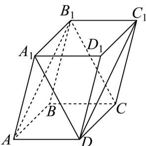

> [!faq]- 《专题04 空间向量的应用（五大题型）（高效培优期中专项训练）数学人教A版2019高二选择性必修第一册》官方解析
>
> > [!success]- **【答案】** A
>
> > [!note]- **【分析】**
> > 根据空间向量的基本定理易得 $DC_{1} = AB + AA_{1}$ ， $B_{1}C = AD - AA_{1}$ ，进而结合空间向量夹角公式求解即可·
>
> > [!note]- **【解析】**
> > 以 $AB, AD, AA_1$ 为基底，则 $DC_1 = AB_1 = AB + AA_1$ ， $B_1C = A_1D = AD - AA_1$ ，则 $\left|DC_1\right| = \sqrt{AB^2 + 2AB \cdot AA_1 + AA_1^2} = \sqrt{1^2 + 2 \times 1 \times 2 \times \cos 60^\circ + 2^2} = \sqrt{7}$ ，则 $\left|B_1C\right| = \sqrt{AD^2 - 2AD \cdot AA_1 + AA_1^2} = \sqrt{1^2 - 2 \times 1 \times 2 \times \cos 60^\circ + 2^2} = \sqrt{3}$ ， $DC_1 \cdot B_1C = (AB + AA_1) \cdot (AD - AA_1) = AB \cdot AD - AB \cdot AA_1 + AA_1 \cdot AD - AA_1^2$ $= 1 \times 1 \times \cos 60^\circ - 1 \times 2 \times \cos 60^\circ + 2 \times 1 \times \cos 60^\circ - 2^2 = -\frac{7}{2}$ ，所以 $\cos \left\langle DC_1, B_1C \right\rangle = \frac{DC_1 \cdot BC}{\left|DC_1\right|\left|B_1C\right|} = \frac{-\frac{7}{2}}{\sqrt{7} \times \sqrt{3}} = -\frac{\sqrt{21}}{6}$ ，则直线 $DC_1, B_1C$ 所成角的余弦值为 $\frac{\sqrt{21}}{6}$ .
> >
> > 故选：A.
> >
> > 
> >
> > 7. 如果直线 $a$ 的方向向量是 $\overline{v_1} = (1,2,4)$ ，直线 $b$ 方向向量是 $\overline{v_2} = (2,1,-1)$ ，那么（ ）A. $a//b$ B. $a$ 与 $b$ 相交 C. $a$ 与 $b$ 异面 D. $a \perp b$
> >
> > 【答案】D
> >
> > 【分析】由向量垂直即可解题·
> >
> > 【详解】因为 $v_{1} \cdot v_{2} = (2, 1, -1) \cdot (1, 2, 4) = 2 + 2 - 4 = 0$
> >
> > 故 $v_{1} \perp v_{2}$ ，所以 $a \perp b$
> >
> > 故选 **D**
