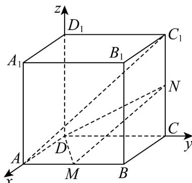
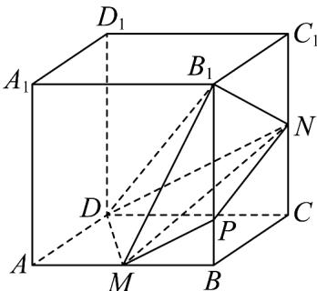

> [!faq]- 《专题04 空间向量的应用（五大题型）（高效培优期中专项训练）数学人教A版2019高二选择性必修第一册》官方解析
>
> > [!success]- **【答案】** A. $AC_{1} // MN$ B. $B_{1}D \perp MN$ C. $AC_{1} //$ 平面 MND D. 三棱锥 $B_{1} - MND$ 的体积为 1
>
> > [!note]- **【分析】**
> > 对于 A, B, C 选项，根据几何体建立空间直角坐标系，根据空间向量的关系即可证明，对于 D 选项，过点 M 作 MP // DN，可得 $MP = \frac{1}{2} DN$ ，所以 $S_{\triangle MPN} = \frac{1}{2} S_{\triangle MDN}$ ，所以 $V_{B_{1}-MND} = 2V_{B_{1}-MNP} = 2V_{M-B_{1}NP}$ ，即可求解.
>
> > [!note]- **【解析】**
> > 对于 A 选项，在正方体 $ABCD - A_{1}B_{1}C_{1}D_{1}$ 中建立空间直角坐标系，则 $A(2,0,0)$ ， $C_{1}(0,2,2)$ ， $M(2,1,0)$ ， $N(0,2,1)$ ，所以 $AC_{1} = (-2,2,2)$ ， $MN = (-2,1,1)$ ，
> >
> > 所以 $AC_{1}$ 与 MN 不共线，所以 $AC_{1}$ 与 MN 不平行，故 A 错误；
> >
> > 对于 B 选项， $D(0,0,0)$ ， $B_{1}(2,2,2)$ ，所以 $\overline{DB}_{1}=(2,2,2)$ ， $\overline{MN}=(-2,1,1)$ ，
> >
> > 所以 $\overline{DB}_{1}\cdot\overline{MN}=2\times(-2)+2\times1+2\times1=0$ ，所以 $B_{1}D\perp MN$ ，故 B 正确；
> >
> > 对于 C 选项， $AC_{1} = (-2, 2, 2)$ ， $DN = (0, 2, 1)$ ， $DM = (2, 1, 0)$ ，
> >
> > 设平面 MND 的法向量为 $n = (x, y, z)$
> >
> > 则 $\left\{ \begin{array}{l} n \cdot DN = 0 \\ \rightarrow \square \square \square \\ n \cdot DM = 0 \end{array} \right.$ ，即 $\left\{ \begin{array}{l} 2y + z = 0 \\ 2x + y = 0 \end{array} \right.$ ，可求得 $n = (-1, 2, -4)$ ，
> >
> > 所以 $n \cdot AC_{1} = (-1) \times (-2) + 2 \times 2 + 2 \times (-4) = -2$ ，所以 n 与 $AC_{1}$ 不垂直，
> >
> > 所以 $AC_{1}$ 不平行于平面 MND ，故 C 错误；
> >
> > 
> >
> > 对于 $^{D}$ 选项，过点M作MP//DN，与 $BB_{1}$ 相交于点P，则M、P、D、N四点共面，
> >
> > 又 $M$ 、 $N$ 分别是 $AB$ 、 $CC_1$ 的中点，所以点 $P$ 为 $BB_1$ 上靠近点 $B$ 的四等分点，所以 $MP = \frac{1}{2} DN$ ，所以 $S_{\triangle MPN} = \frac{1}{2} S_{\triangle MDN}$ ，所以 $V_{B_1 - MND} = 2V_{B_1 - MNP} = 2V_{M - B_1NP}$ ，
> >
> > 又 $V_{M - B_1NP} = \frac{1}{3}\cdot MB\cdot S_{\triangle B_1NP} = \frac{1}{3}\cdot MB\cdot \frac{1}{2}\cdot \frac{3}{4} BB_1\cdot BC = \frac{1}{3}\times 1\times \frac{1}{2}\times \frac{3}{4}\times 2\times 2 = \frac{1}{2}$
> >
> > 所以 $V_{B_{1}-MND}=2V_{M-B_{1}NP}=2\times\frac{1}{2}=1$ ，故 D 正确.
> >
> > 
> >
> > 故选 **BD**
