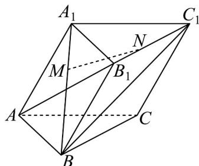

> [!faq]- 《专题04 空间向量的应用（五大题型）（高效培优期中专项训练）数学人教A版2019高二选择性必修第一册》官方解析
>
> > [!success]- **【答案】**  A. $\overset{\text{UUU}}{AB}$ 与 $\overset{\text{UUUU}}{B_{1}C_{1}}$ 的夹角为 $60^{\circ}$ B. $MN = \frac{1}{3}a + \frac{1}{3}b + \frac{1}{3}c$ C. $\left|\overrightarrow{MN}\right|=\frac{\sqrt{5}}{3}$ D. MN ⊥ BC
>
> > [!note]- **【分析】**
> > 由空间向量的运算法则和空间向量的夹角公式、模长公式、数量积的定义对选项一一判断即可得出答案.
>
> > [!note]- **【解析】**
> > 对于 A，∵ AB = AC = 1， $\angle BAC = 90^{\circ}$ ，∴ $\angle ABC = 45^{\circ}$ ，所以 AB 与 BC 的夹角为 $135^{\circ}$ ，又 $BC = B_{1}C_{1}$ ，所以 AB 与 $B_{1}C_{1}$ 的夹角为 $135^{\circ}$ ，故 A 错误；
> >
> > 对于 B，因为 $BM = 2A_{1}M$ ， $C_{1}N = 2B_{1}N$ ，
> > 所以 $A_{1}N = A_{1}B_{1} + B_{1}N = AB + \frac{1}{3}B_{1}C_{1} = AB + \frac{1}{3}BC = AB + \frac{1}{3}(AC - AB) = \frac{2}{3}AB + \frac{1}{3}AC$ ， $A_{1}M=\frac{1}{3}A_{1}B=\frac{1}{3}\left(AB-AA_{1}\right)$ ∴ $MN = A_{1}N - A_{1}M = \frac{2}{3}AB + \frac{1}{3}AC - \frac{1}{3}\left(AB-AA_{1}\right) = \frac{1}{3}AB + \frac{1}{3}AC + \frac{1}{3}AA_{1} = \frac{1}{3}a + \frac{1}{3}b + \frac{1}{3}c$ ，故 B 正确；
> > 对于 C，∵ $|a| = |b| = |c| = 1$ ， $\angle BAC = 90^{\circ}$ ， $\angle BAA_{1} = \angle CAA_{1} = 60^{\circ}$ ，
> > ∴ $a \cdot b = 0$ ， $a \cdot c = \frac{1}{2}$ ， $b \cdot c = \frac{1}{2}$ ，
> > ∴ $\left|MN\right|^{2}=\left(\frac{1}{3}a+\frac{1}{3}b+\frac{1}{3}c\right)^{2}=\frac{1}{9}a^{2}+\frac{1}{9}b^{2}+\frac{1}{9}c^{2}+\frac{2}{9}a \cdot b + \frac{2}{9}a \cdot c + \frac{2}{9}c \cdot b$ $=\frac{1}{9}+\frac{1}{9}+\frac{1}{9}+\frac{2}{9}\times\frac{1}{2}+\frac{2}{9}\times\frac{1}{2}=\frac{5}{9}$ ∴ $\left|MN\right|=\frac{\sqrt{5}}{3}$ ，故 C 正确；
> > 对于 D， $MN \cdot BC = \left(\frac{1}{3}a + \frac{1}{3}b + \frac{1}{3}c\right) \cdot (b - a) = -\frac{1}{3}a^{2} + \frac{1}{3}b^{2} + \frac{1}{3}b \cdot c - \frac{1}{3}a \cdot c = 0$ ，
> > ∴ $MN \perp BC$ ，故 D 正确。
> >
> > 故选 **BCD**.
