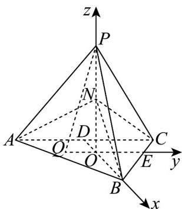

> [!faq]- 《专题04 空间向量的应用（五大题型）（高效培优期中专项训练）数学人教A版2019高二选择性必修第一册》官方解析
>
> > [!success]- **【答案】**  A. $AN \perp PC$ B. 点 $C$ 到平面 $ABN$ 的距离为 $3\sqrt{2}$ C. 如果在此正四面体中放入一个小球（全部进入），则小球半径的最大值为 $\frac{\sqrt{6}}{3}$ D．动点 Q 在平面 ABC 内，且满足 $\left|PQ\right|\leq5$ ，则动点 Q 的轨迹表示图形的面积为 $\pi$
>
> > [!note]- **【分析】**
> > 取 AC 的中点 D，连接 BD，建立空间直角坐标系，利用空间向量法判断 $\Lambda$ ，根据等体积法判断
> >
> > B，求出内切球的半径，即可判断 C，连接 $OQ$ ，即可得到 $OQ \leq 1$ ，从而判断 D.
>
> > [!note]- **【解析】**
> > 取 $AC$ 的中点 $D$ ，连接 $BD$ ，则 $BD \perp AC$ 且 $O$ 为靠近 $D$ 的一个三等分点，过点 $O$ 作 $OE // AC$ 交 $BC$ 于点 $E$ ，则 $OE \perp OB$ ，
> >
> > 又 $PO \perp$ 平面 $ABC$ ，如图建立空间直角坐标系，
> >
> > 因为 $BD = \sqrt{6^2 - 3^2} = 3\sqrt{3}$ ，所以 $OP = \sqrt{6^2 - (2\sqrt{3})^2} = 2\sqrt{6}$ ，
> >
> > 则 $A\left(-\sqrt{3}, - 3,0\right)$ ， $C\left(-\sqrt{3},3,0\right)$ ， $B\left(2\sqrt{3},0,0\right)$ ， $P\left(0,0,2\sqrt{6}\right)$ ， $N\left(0,0,\sqrt{6}\right)$
> >
> > 所以 $PC = (-\sqrt{3}, 3, -2\sqrt{6})$ ， $AN = (\sqrt{3}, 3, \sqrt{6})$
> >
> > 所以 $\overset{\square\square}{AN}\cdot\overset{\square\square}{PC}=-\sqrt{3}\times\sqrt{3}+3\times3+\left(-2\sqrt{6}\right)\times\sqrt{6}=-6\neq0$ ，所以 AN 与 PC 不垂直，故 A 错误；
> >
> > 因为 $AN = BN = \sqrt{\left(2\sqrt{3}\right)^2 + \left(\sqrt{6}\right)^2} = 3\sqrt{2}$ ，所以 $S_{\triangle ABN} = \frac{1}{2} \times 6 \times \sqrt{\left(3\sqrt{2}\right)^2 - 3^2} = 9$
> >
> > 又 $S_{\triangle ABC}=\frac{1}{2}\times3\sqrt{3}\times6=9\sqrt{3}$ ，所以 $V_{N-ABC}=\frac{1}{3}\times9\sqrt{3}\times\sqrt{6}=9\sqrt{2}$ ，
> >
> > 设点 C 到平面 ABN 的距离为 d，则 $V_{N-ABC} = V_{C-ABN} = \frac{1}{3} S_{\triangle ABN} d = 9\sqrt{2}$ ，解得 $d = 3\sqrt{2}$ ，
> >
> > 即点 $C$ 到平面 $ABN$ 的距离为 $3\sqrt{2}$ ，故 ${}^{\mathrm{B}}$ 正确；
> >
> > 对于 C：因为 $V_{P-ABC}=\frac{1}{3}\times9\sqrt{3}\times2\sqrt{6}=18\sqrt{2}$ ，设正四面体的内切球的半径为 r，
> >
> > 则 $V_{P-ABC} = \frac{4}{3} S_{\triangle ABC} r$ ，即 $\frac{4}{3} \times 9\sqrt{3} r = 18\sqrt{2}$ ，解得 $r = \frac{\sqrt{6}}{2}$ ，
> >
> > 所以在此正四面体中放入一个小球（全部进入），则小球半径的最大值为 $\frac{\sqrt{6}}{2}$ ，故 $C$ 错误；
> >
> > 对于 D：连接 OQ，因为 $OP = \sqrt{6^{2} - (2\sqrt{3})^{2}} = 2\sqrt{6}$ ， $PO \perp$ 平面 ABC， $OQ \subset$ 平面 ABC，
> >
> > 所以 $PO \perp OQ$ ，所以 $PQ = \sqrt{OP^2 + OQ^2} = \sqrt{24 + OQ^2} \leq 5$ ，所以 $OQ^2 \leq 1$
> >
> > 则点 $Q$ 在平面 $ABC$ 所表示的图形为以 $O$ 为圆心，1为半径的圆面，
> >
> > 所以动点 $Q$ 的轨迹表示图形的面积为 $\pi \times 1^2 = \pi$ ，故D正确·
> >
> > 故选：BD
> >
> > 
