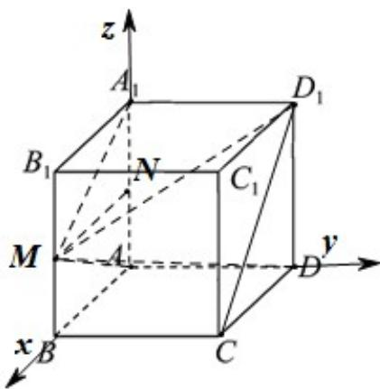

> [!faq]- 《专题04 空间向量的应用（五大题型）（高效培优期中专项训练）数学人教A版2019高二选择性必修第一册》官方解析
>
> > [!success]- **【答案】** BD
>
> > [!note]- **【分析】**
> > 建系，借助空间向量的方法判断 $^{AB}$ ；利用AM与平面ABCD所成的角为 $\angle MAB$ ，求出 $\tan\angle MAB=\frac{1}{2}$ ，判断 $^{C}$ ；求出四棱锥 $M-ADD_{1}A_{1}$ 的高，利用体积公式求体积判断 $^{D}$ .
>
> > [!note]- **【解析】**
> > 
> >
> > 如图，以 A 为坐标原点，以 $AB, AD, AA_{1}$ 所在直线分别为 x, y, z 轴，建立如图所示空间直角坐标系，因为 AB = 3 ，
> >
> > 所以 $A(0,0,0)$ ， $M\left(3,0,\frac{3}{2}\right)$ ， $D_{1}(0,3,3)$ ， $C(3,3,0)$
> >
> > 对于 A， $AM=\left(3,0,\frac{3}{2}\right),D_{1}C=\left(3,0,-3\right)$ ，因为 $AM\cdot D_{1}C=3\times3+\left(-3\right)\times\frac{3}{2}=\frac{9}{2}\neq0$
> >
> > 所以 $AM, D_{1}C$ 不垂直，故 A 错误；
> >
> > 对于 B，由图知，面 $DCC_{1}D_{1}$ 的一个法向量为 $m=(0,1,0)$ ，由 A 得， $AM=\left(3,0,\frac{3}{2}\right)$
> >
> > 所以 $m \cdot AM = 0 \times 3 + 1 \times 0 + 0 \times \frac{3}{2} = 0$ ，所以 $m \perp AM$ ，AM 不在平面 $DCC_{1}D_{1}$ 内，
> >
> > 故 $AM \parallel$ 平面 $DCC_{1}D_{1}$ ，故 $\mathsf{B}$ 正确；
> >
> > 对于 $C$ ，因为 $MB \perp$ 平面 $ABCD$ ，所以 $AM$ 与平面 $ABCD$ 所成的角即为 $\angle MAB$ ，
> >
> > 在 Rt△MBA 中， $MB=\frac{3}{2}$ ，AB=3， $\tan\angle MAB=\frac{MB}{AB}=\frac{1}{2}\neq\tan30^{\circ}$ ，所以 AM 与平面 ABCD 所成的角不为 $30^{\circ}$ ，
> >
> > 故 $^{C}$ 错误；
> >
> > 对于 D，取 $AA_{1}$ 中点为 N，MN//AB， $AB \perp$ 平面 $ADD_{1}A_{1}$ ，所以 $MN \perp$ 平面 $ADD_{1}A_{1}$ ，
> >
> > 所以 $MN$ 的长即为四棱锥 $M - ADD_{1}A_{1}$ 的高，所以四棱锥 $M - ADD_{1}A_{1}$ 的体积为 $\frac{1}{3} \times 3 \times 3 \times 3 = 9$ ，故D正确，
> >
> > 故选 **BD**
