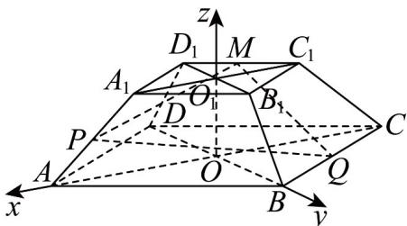

> [!faq]- 《专题04 空间向量的应用（五大题型）（高效培优期中专项训练）数学人教A版2019高二选择性必修第一册》官方解析
>
> > [!success]- **【答案】**  A. 3 B. $\sqrt{15}$ C. $\frac{3\sqrt{3}}{2}$ D. 4
>
> > [!note]- **【分析】**
> > 根据题意，以 O 为坐标原点建立空间直角坐标系，令 $A_{1}P = \lambda A_{1}A$ ，利用 $MP \perp MQ$ ，得 $MP \cdot MQ = 0$ 即可求出 $\lambda$ ，再求线段 PQ 的长度即可.
>
> > [!note]- **【解析】**
> > 如图，连接 $AC$ ，BD交于点 $O$ ，连接 $A_{1}C_{1}$ ， $B_{1}D_{1}$ 交于点 $O_{1}$ ，连接 $OO_{1}$
> >
> > 
> >
> > 由正四棱台的结构特征，易知 AC，BD， $OO_{1}$ 两两垂直，
> >
> > 故以 O 为坐标原点，OA，OB， $OO_{1}$ 所在直线分别为 x，y，z 轴建立空间直角坐标系。
> >
> > 因为在正四棱台 $ABCD - A_{1}B_{1}C_{1}D_{1}$ 中，AB = 3， $A_{1}B_{1} = 1$ ， $AA_{1} = 2$ ，
> >
> > 所以 $OA = OB = \frac{3\sqrt{2}}{2}$ ， $O_{1}A_{1} = O_{1}B_{1} = \frac{\sqrt{2}}{2}$ ， $OO_{1} = \sqrt{AA_{1}^{2} - (OA - O_{1}A_{1})^{2}} = \sqrt{2}$
> >
> > 则 $A\left(\frac{3\sqrt{2}}{2},0,0\right)$ ， $B\left(0,\frac{3\sqrt{2}}{2},0\right)$ ， $C\left(-\frac{3\sqrt{2}}{2},0,0\right)$ ， $A_{1}\left(\frac{\sqrt{2}}{2},0,\sqrt{2}\right)$
> >
> > $C_1\left(-\frac{\sqrt{2}}{2},0,\sqrt{2}\right),D_1\left(0, - \frac{\sqrt{2}}{2},\sqrt{2}\right)$
> >
> > 因为 $M$ 是 $C_1D_1$ 的中点，所以 $M\left(-\frac{\sqrt{2}}{4}, - \frac{\sqrt{2}}{4},\sqrt{2}\right)$ . 令 $\overline{A_1P} = \lambda \overline{A_1A}$
> >
> > $$
> > \frac {\square \square \square}{M P} = \frac {\square \square \square \square}{M A _ {1}} + \lambda A _ {1} A = \left(\frac {3 \sqrt {2}}{4}, \frac {\sqrt {2}}{4}, 0\right) + \lambda (\sqrt {2}, 0, - \sqrt {2}) = \left(\frac {3 \sqrt {2}}{4} + \sqrt {2} \lambda , \frac {\sqrt {2}}{4}, - \sqrt {2} \lambda\right)
> > $$
> >
> > $$
> > M Q = M B + \frac {1}{2} B C = \left(\frac {\sqrt {2}}{4}, \frac {7 \sqrt {2}}{4}, - \sqrt {2}\right) + \frac {1}{2} \left(- \frac {3 \sqrt {2}}{2}, - \frac {3 \sqrt {2}}{2}, 0\right) = \left(- \frac {\sqrt {2}}{2}, \sqrt {2}, - \sqrt {2}\right)
> > $$
> >
> > 要使 $MP \perp MQ$ ，则 $\overline{MP} \cdot \overline{MQ} = 0$
> >
> > 则 $\left(\frac{3\sqrt{2}}{4} +\sqrt{2}\lambda ,\frac{\sqrt{2}}{4}, - \sqrt{2}\lambda\right)\cdot \left(-\frac{\sqrt{2}}{2},\sqrt{2}, - \sqrt{2}\right) = -\frac{3}{4} -\lambda +\frac{1}{2} +2\lambda = 0$
> >
> > 解得 $\lambda=\frac{1}{4}$ ，所以 $\overrightarrow{MP}=\left(\sqrt{2},\frac{\sqrt{2}}{4},-\frac{\sqrt{2}}{4}\right)$
> >
> > 所以 $\overrightarrow{PQ} = \overrightarrow{MQ} -\overrightarrow{MP} = \left(-\frac{\sqrt{2}}{2},\sqrt{2}, - \sqrt{2}\right) - \left(\sqrt{2},\frac{\sqrt{2}}{4}, - \frac{\sqrt{2}}{4}\right) = \left(-\frac{3\sqrt{2}}{2},\frac{3\sqrt{2}}{4}, - \frac{3\sqrt{2}}{4}\right)$ 所以 $\left|\overrightarrow{PQ}\right| = \sqrt{\left(-\frac{3\sqrt{2}}{2}\right)^2 + \left(\frac{3\sqrt{2}}{4}\right)^2 + \left(-\frac{3\sqrt{2}}{4}\right)^2} = \frac{3\sqrt{3}}{2}$
> >
> > 故选 **C**.
