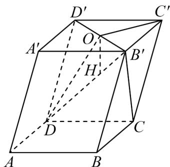

> [!faq]- 《专题04 空间向量的应用（五大题型）（高效培优期中专项训练）数学人教A版2019高二选择性必修第一册》官方解析
>
> > [!success]- **【答案】** (1) $AA' + \frac{1}{2}AB - \frac{1}{2}AD$ (2)证明见解析
>
> > [!note]- **【分析】**
> > $^{1}$ ）利用向量的线性表示与化简运算求解即可；
> >
> > (2) 利用向量的线性运算可得 $\overline{B^{\prime}C} = \overline{OD} + \overline{OC^{\prime}}$ ，由线面平行判断定理即可证明.
>
> > [!note]- **【解析】**
> > （1） $\overline{DO}=\overline{AO}-\overline{AD}=\overline{AA'}+\overline{A'O}-\overline{AD}=\overline{AA'}+\frac{1}{2}\overline{AB}+\frac{1}{2}\overline{AD}-\overline{AD}=\overline{AA'}+\frac{1}{2}\overline{AB}-\frac{1}{2}\overline{AD}$
> >
> > (2) 因为 $B^{\prime}C = B^{\prime}O + OC^{\prime} + C^{\prime}C = OD^{\prime} + D^{\prime}D + OC^{\prime} = OD + OC^{\prime}$ ，取 $DC^{\prime}$ 中点 $H$ 则 $B^{\prime}C = OD + OC^{\prime} = 2OH$ ，所以 $B^{\prime}C // OH$ ，由于 $B^{\prime}C \notin$ 平面 $ODC^{\prime}$ ， $OH \subset$ 平面 $ODC^{\prime}$ ，所以 $B^{\prime}C //$ 平面 $ODC^{\prime}$ 。
> >
> > 
> >
> > ## 考点 04 用空间向量研究夹角问题
