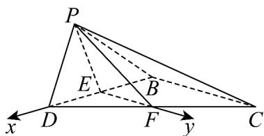

> [!faq]- 《专题04 空间向量的应用（五大题型）（高效培优期中专项训练）数学人教A版2019高二选择性必修第一册》官方解析
>
> > [!success]- **【答案】** (1) $\frac{\sqrt{3}}{3}$ (2) $\frac{\sqrt{105}}{35}$ (3) $\frac{1}{5}$
>
> > [!note]- **【分析】**
> > 分析图 $^{1}$ 折叠到图 $^{2}$ 后，有哪些量是不变的量，并找到底面的垂直关系，建立空间直角坐标系，根据已知条件分别确定 $^{3}$ 个小题中点P的坐标，然后利用向量分别解决对应小题中的问题·
>
> > [!note]- **【解析】**
> > （1）取棱 $BD$ 的中点 $E$ ，棱 $CD$ 的中点 $F$ ，连接 $PE$ ， $PF$ ， $EF$
> >
> > 图 $^{1}$ 中：因为梯形ABCD中， $AB \parallel DC$ ， $AB \perp AD$ ， $AB = AD = \frac{1}{2}DC = 2$
> >
> > 所以 $CD = 4, BD = 2\sqrt{2}, AD \perp CD, \angle ADB = 45^{\circ}$ , 所以 $\angle BDC = 45^{\circ}$ .
> >
> > $\triangle BCD$ 中，由余弦定理得： $BC^{2} = BD^{2} + CD^{2} - 2BD\times CD\cos 45^{\circ} = 8,$
> >
> > 所以 $BC = 2\sqrt{2} \cdot$ 所以 $BD^{2} + BC^{2} = CD^{2}$ ，所以 $BD \perp BC \cdot$
> >
> > 图2中 $EF / / BC, EF = \frac{1}{2} BC = \sqrt{2}$ ，所以 $EF \perp BD$ ；
> >
> > 因为 $PB = PD, PB \perp PD$ ，所以 $PE \perp BD, PE = \frac{1}{2} BD = \sqrt{2}$ ，所以 $\angle PEF = \theta$ 。
> >
> > 以点 E 为坐标原点，ED 所在直线为 x 轴，EF 所在直线为 y 轴建立空间直角坐标系·则 $E(0,0,0), D(\sqrt{2},0,0), B(-\sqrt{2},0,0), F(\sqrt{2},0,0), C(-\sqrt{2},2\sqrt{2},0)$ .
> >
> > 若 $\theta = 90^{\circ}$ ，则 $\angle PEF = 90^{\circ}$ ，所以 $PE\perp EF$ ，且 $PF = \sqrt{PE^2 + EF^2} = 2$
> >
> > 因为 $BD, EF \subset$ 平面 $BCD$ , 且 $BD \cap EF = E$ , 所以 $PE \perp$ 平面 $BCD$ .
> >
> > 所以点 $P(0,0,\sqrt{2})$ ，则 $\overline{BP} = (\sqrt{2},0,\sqrt{2})$ ， $\overline{CP} = (\sqrt{2}, - 2\sqrt{2},\sqrt{2}),\overline{DP} = (-\sqrt{2},0,\sqrt{2}).$
> >
> > 设平面 $PCD$ 的法向量为 $n = (x,y,z)$ ，则 $\left\{ \begin{array}{l} n \cdot CP = 0 \\ \rightarrow \square \square \\ n \cdot DP = 0 \end{array} \right.$ ，
> >
> > 所以 $\left\{ \begin{array}{l} \sqrt{2} x - 2\sqrt{2} y + \sqrt{2} z = 0 \\ -\sqrt{2} x + \sqrt{2} z = 0 \end{array} \right.$ ，令 $x = 1$ 则 $y = z = 1$ ，
> >
> > 所以平面 PCD 的一个法向量为 $n = (1, 1, 1)$ .
> >
> > $$
> > \cos \left\langle \overrightarrow {B P}, \overrightarrow {n} \right\rangle = \frac {\overrightarrow {B P} \cdot n}{| B P | | n |} = \frac {2 \sqrt {2}}{2 \times \sqrt {3}} = \frac {\sqrt {6}}{3}.
> > $$
> >
> > 所以 $PB$ 与平面 $PCD$ 所成角的正弦值为 $\frac{\frac{2\sqrt{6}}{3}}{2} = \frac{\sqrt{6}}{3}$
> >
> > 所以 $PB$ 与平面 $PCD$ 所成角的余弦值为 $\sqrt{1 - \left(\frac{\sqrt{6}}{3}\right)^2} = \frac{\sqrt{3}}{3}$ .
> >
> > 方法二： $\triangle PDF$ 中， $PF = DF = PD = 2$ ，所以 $\angle PDF = 60^{\circ}$ 。
> >
> > 所以 $S_{\triangle PCD} = \frac{1}{2} PD \times DC \times \sin \angle PDF = 2\sqrt{3}$ , $S_{\triangle BCD} = \frac{1}{2} \times BC \times BD = 4$ .
> >
> > 因为 $V_{P-BCD}=V_{B-PCD}$ ，所以点 B 到平面 PCD 的距离 $d_{B-PCD}=\frac{\frac{1}{3}S_{\triangle BCD}\times PE}{\frac{1}{3}S\triangle PCD}=\frac{2\sqrt{6}}{3}$ .
> >
> > 所以 $PB$ 与平面 $PCD$ 所成角的正弦值为 $\frac{\frac{2\sqrt{6}}{3}}{2} = \frac{\sqrt{6}}{3}$
> >
> > 所以 $PB$ 与平面 $PCD$ 所成角的余弦值为 $\sqrt{1 - \left(\frac{\sqrt{6}}{3}\right)^2} = \frac{\sqrt{3}}{3}$ .
> >
> > 
> >
> > (2) 由 $^{(1)}$ 知： $\theta=\angle PEF\cdot$ 以点E为坐标原点，ED所在直线为x轴，
> >
> > EF 所在直线为 y 轴建立空间直角坐标系·
> >
> > $$
> > E (0, 0, 0), D (\sqrt {2}, 0, 0), B (- \sqrt {2}, 0, 0), F (\sqrt {2}, 0, 0), C (- \sqrt {2}, 2 \sqrt {2}, 0)
> > $$
> >
> > 设 $P(a,b,c)(c > 0)$ ，则 $\overline{DP} = (a - \sqrt{2},b,c)$ ， $\overline{EP} = (a,b,c),\overline{EF} = (0,\sqrt{2},0)$ ，所以 $\overline{EP}\cdot EF = \sqrt{2} b\cdot$
> >
> > 因为 DP=2， $PE=EF=\sqrt{2}$ ， $\theta=120^{\circ}$ ，所以 $\left\{\begin{aligned}\sqrt{a^{2}+b^{2}+c^{2}}&=\sqrt{2}\\ \sqrt{2}b=\sqrt{2}\times\sqrt{2}\times\left(-\frac{1}{2}\right)\\ \sqrt{(a-\sqrt{2})^{2}+b^{2}+c^{2}}&=2\end{aligned}\right.$
> >
> > 解得： $\left\{ \begin{array}{ll}a = 0\\ b = -\frac{\sqrt{2}}{2}\\ c = \frac{\sqrt{6}}{2} \end{array} \right.$ ，所以 $P\left(0, - \frac{\sqrt{2}}{2},\frac{\sqrt{6}}{2}\right)$
> >
> > $$
> > \stackrel {\square \square \square} {P C} = \left(- \sqrt {2}, \frac {5 \sqrt {2}}{2}, - \frac {\sqrt {6}}{2}\right), \stackrel {\square \square \square} {B C} = (0, 2 \sqrt {2}, 0), \stackrel {\square \square \square} {C D} = (2 \sqrt {2}, - 2 \sqrt {2}, 0).
> > $$
> >
> > 设平面 的法向量为 $n_{1}=\left(x_{1},y_{1},z_{1}\right)$ ，由 $\left\{\begin{aligned}&\square\quad\square\square\square\\&n_{1}\cdot PC=0\\&n_{1}\cdot BC=0\end{aligned}\right.$ 得 $\left\{\begin{aligned}-\sqrt{2}x_{1}+\frac{5\sqrt{2}}{2}y_{1}-\frac{\sqrt{6}}{2}z_{1}=0\\2\sqrt{2}y_{1}=0\end{aligned}\right.$
> >
> > 令 $x_{1} = \sqrt{3}$ ，则 $z_{1} = -2\cdot$ 所以平面 $PBC$ 的一个法向量为 $\stackrel {\sqcup}{n}_{1} = (\sqrt{3},0, - 2)$
> >
> > 设平面 的法向量为 $n_{2}=\left(x_{1},y_{2},z_{2}\right)$ ，由 $\left\{\begin{aligned}&\sqcup\sqcup\sqcup C=0\\ &\square\square\square\square\square\\ &n_{2}\cdot CD=0\end{aligned}\right.$ 得 $\left\{\begin{aligned}-\sqrt{2}x_{2}+\frac{5\sqrt{2}}{2}y_{2}-\frac{\sqrt{6}}{2}z_{2}=0\\ 2\sqrt{2}x_{2}-2\sqrt{2}y_{2}=0\end{aligned}\right.$
> >
> > 令 $x_{2} = 1$ ，则 $y_{2} = 1, z_{2} = \sqrt{3}$ 所以平面 $PCD$ 的一个法向量为 $\overline{n}_{2} = (1, 1, \sqrt{3})$ .
> >
> > $$
> > \cos \left\langle \vec {n} _ {1}, \vec {n} _ {2} \right\rangle = \frac {\vec {n} _ {1} \cdot \vec {n}}{\left| n _ {1} \right| \left| n _ {2} \right|} = \frac {- \sqrt {3}}{\sqrt {7} \times \sqrt {5}} = - \frac {\sqrt {1 0 5}}{3 5}.
> > $$
> >
> > 所以平面 $PBC$ 与平面 $PCD$ 夹角的余弦值为 $\frac{\sqrt{105}}{35}$ .
> >
> > (3) 由 $^{(1)}$ 知： $\theta=\angle PEF\cdot$ 以点E为坐标原点，ED所在直线为x轴，
> >
> > EF 所在直线为 y 轴建立空间直角坐标系·
> >
> > 则 $E(0,0,0),D(\sqrt{2},0,0),B(-\sqrt{2},0,0),F(\sqrt{2},0,0),C(-\sqrt{2},2\sqrt{2},0)$
> >
> > 设 $P(a,b,c)(c > 0)$ ，则 $\overline{DP} = (a - \sqrt{2},b,c)$ ， $\overline{EP} = (a,b,c),\overline{EF} = (0,\sqrt{2},0)$
> >
> > 因为 DP=2， $PE=\sqrt{2}$ ，所以 $\left\{\begin{aligned}\sqrt{a^{2}+b^{2}+c^{2}}&=\sqrt{2}\\ \sqrt{(a-\sqrt{2})^{2}+b^{2}+c^{2}}&=2\end{aligned}\right.$ ，所以： $\left\{\begin{aligned}a&=0\\ b^{2}+c^{2}&=2\end{aligned}\right.$
> >
> > 因为 $PC = (-\sqrt{2} - a, 2\sqrt{2} - b, -c) = (-\sqrt{2}, 2\sqrt{2} - b, -c)$ , $CD = (2\sqrt{2}, -2\sqrt{2}, 0)$ .
> >
> > 设平面 $PCD$ 的法向量为 $n_2 = (x_1, y_2, z_2)$
> >
> > 由 $\left\{\begin{aligned}n_{2}\cdot PC&=0\\ n_{2}\cdot CD&=0\end{aligned}\right.$ 得 $\left\{\begin{aligned}&(-\sqrt{2})x_{2}+(2\sqrt{2}-b)y_{2}-cz_{2}&=0\\ &2\sqrt{2}x_{2}-2\sqrt{2}y_{2}&=0\end{aligned}\right.$
> >
> > 令 $x_{2} = c$ ，则 $y_{2} = c, z_{2} = \sqrt{2} - b$ 所以平面PCD的一个法向量为 $\overline{n_2} = (c, c, \sqrt{2} - b)$ .
> >
> > 因为 $BD = (2\sqrt{2}, 0, 0)$ ，所以点 B 到平面 PCD 的距离为 $d = \left| \frac{BD \cdot n_{2}}{|n_{2}|} \right| = \frac{2\sqrt{2}c}{\sqrt{2c^{2} + (\sqrt{2} - b)^{2}}} = \sqrt{3}$ 整理得： $\left(5b - \sqrt{2}\right)\left(b - \sqrt{2}\right) = 0$ ，所以 $\left\{ \begin{array}{l}b = \frac{\sqrt{2}}{5}\\ c = \frac{4\sqrt{3}}{5} \end{array} \right.$ 或 $\left\{ \begin{array}{l}b = \sqrt{2}\\ c = 0 \end{array} \right.$ （舍去）.
> >
> > 所以 $\overrightarrow{EP} = \left(0, \frac{\sqrt{2}}{5}, \frac{4\sqrt{3}}{5}\right)$ ，所以 $\cos \theta = \frac{\overrightarrow{EP} \cdot \overrightarrow{EE}}{|EP||EF|} = \frac{\frac{2}{5}}{\sqrt{2} \times \sqrt{2}} = \frac{1}{5}$ .
