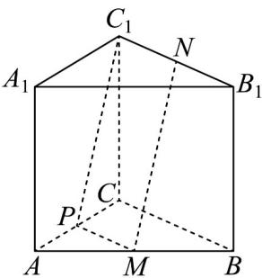
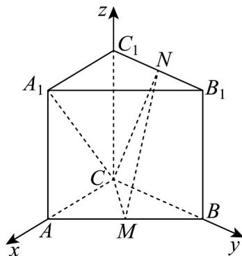
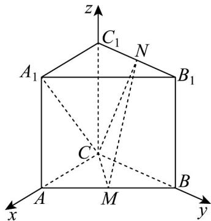

> [!faq]- 《专题04 空间向量的应用（五大题型）（高效培优期中专项训练）数学人教A版2019高二选择性必修第一册》官方解析
>
> > [!success]- **【答案】** (1)证明见解析； (2) $2\sqrt{2}$ ; (3) $\frac{\sqrt{15}}{5}.$
>
> > [!note]- **【分析】**
> > （ $^{1}$ ）构造辅助线，利用线面平行判定定理；
> >
> > (2) 建立空间直角坐标系，求平面 CMN 和平面 CMB 的法向量，求出二面角的平面角的正切值；
> >
> > (3) 建立空间直角坐标系，求平面 $CMN$ 的法向量及线面角的正弦值.
>
> > [!note]- **【解析】**
> > （1）如图，取 $AC$ 的中点 $P$ ，连接 $PM$ 、 $PC_{1}$
> >
> > 因为 $M$ 、 $P$ 分别为 $AB$ 、 $AC$ 的中点，所以 $PM \parallel BC$ 且 $PM = \frac{1}{2} BC$
> >
> > 又因为直三棱柱 $ABC - A_{1}B_{1}C_{1}$ 中， $N$ 为 $B_{1}C_{1}$ 的中点，所以 $BC // C_{1}N$ 且 $\frac{1}{2} BC = C_{1}N$
> >
> > 所以 $PM / / C_1N$ 且 $PM = C_1N$ ，故四边形 $PMNC_{1}$ 是平行四边形，从而 $MN / / PC_{1}$
> >
> > 因为 $PC_{1} \subset$ 平面 $ACC_{1}A_{1}$ ，MN ∉ 平面 $ACC_{1}A_{1}$ ，所以 MN // 平面 $ACC_{1}A_{1}$ .
> >
> > 
> >
> > (2) 以 C 为原点，CA、CB、 $CC_{1}$ 所在直线分别为 x、y、z 轴建立空间直角坐标系，设 $AC = BC = CC_{1} = 2$ ，则 $C(0,0,0), M(1,1,0), N(0,1,2), B(0,2,0)$ ，
> >
> > 平面 CMB 的法向量为 $n_{1}$ = (0,0,1)
> >
> > 设平面 CMN 的法向量为 $n_{2} = (x, y, z)$ ， $CM = (1, 1, 0)$ ， $CN = (0, 1, 2)$
> >
> > 则 $\left\{ \begin{array}{ll}n_{2}\cdot CM = x + y = 0\\ n_{2}\cdot CN = y + 2z = 0 \end{array} \right.$ ，令 $z = 1$ ，得 $y = -2,x = 2$ ，故 $n_2 = (2, - 2,1)$
> >
> > 设二面角 $N - CM - B$ 的平面角为 $\theta$ ，则 $\cos \theta = \frac{|\vec{n}_1 \cdot \vec{n}_2|}{|n_1||n_2|} = \frac{1}{3}$ ，则 $\sin \theta = \frac{2\sqrt{2}}{3}$ ，
> >
> > 所以 $\tan\theta=\frac{\sin\theta}{\cos\theta}=2\sqrt{2}$
> >
> > 
> >
> > (3) 由 $AC = 2\sqrt{2}$ ， $AB = 4$ ， $\angle ACB = 90^{\circ}$ ，得 $BC = \sqrt{AB^{2} - AC^{2}} = 2\sqrt{2}$
> >
> > 设 $CC_{1} = h$ ，则 $C(0,0,0),A(2\sqrt{2},0,0),B(0,2\sqrt{2},0),A_{1}(2\sqrt{2},0,h),M(\sqrt{2},\sqrt{2},0),N(0,\sqrt{2},h)$
> >
> > $$
> > M N = (- \sqrt {2}, 0, h) \quad , \quad A _ {1} C = (- 2 \sqrt {2}, 0, - h)
> > $$
> >
> > 由 $MN \perp A_{1}C$ 得 $MN \cdot A_{1}C = 4 - h^{2} = 0$ ，解得 $h = 2(h > 0)$
> >
> > $\overline{CM}=(\sqrt{2},\sqrt{2},0)$ ， $\overline{CN}=(0,\sqrt{2},2)$ ，设平面CMN的法向量为 $n=(a,b,c)$
> >
> > 则 $\left\{ \begin{array}{l} n \cdot CM = \sqrt{2} a + \sqrt{2} b = 0 \\ n \cdot CN = \sqrt{2} b + 2c = 0 \end{array} \right.$ ，令 $b = \sqrt{2}$ ，得 $a = -\sqrt{2}, c = -1$ ，故 $n = (-\sqrt{2}, \sqrt{2}, -1)$ ，
> >
> > $$
> > A _ {1} C = (- 2 \sqrt {2}, 0, - 2)
> > $$
> >
> > 设 $A_{1}C$ 与平面 $CMN$ 所成角为 $\alpha$ ，则 $\sin \alpha = \frac{|A_1C \cdot n|}{|A_1C||n|} = \frac{|4 + 2|}{\sqrt{8 + 4} \cdot \sqrt{2 + 2 + 1}} = \frac{6}{2\sqrt{3} \cdot \sqrt{5}} = \frac{\sqrt{15}}{5}$
> >
> > 
