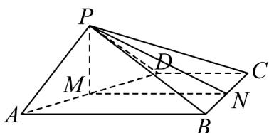
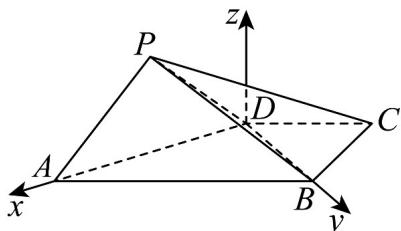

> [!faq]- 《专题04 空间向量的应用（五大题型）（高效培优期中专项训练）数学人教A版2019高二选择性必修第一册》官方解析
>
> > [!success]- **【答案】** (1)证明见解析； (2) 存在， $\frac{PT}{PB}=\frac{1}{3}$ .
>
> > [!note]- **【分析】**
> > （1）设线段 $AD$ 的中点为 $M$ ，线段 $BC$ 的中点为 $N$ ，利用线面垂直的判定、性质，面面垂直的判定推理得证·
> >
> > (2) 根据已知，以 $D$ 为原点，构建如下图空间直角坐标系 $D - xyz$ ，令 $\overrightarrow{PT} = \lambda \overrightarrow{PB} = (-\frac{\sqrt{2}}{2}\lambda, \sqrt{2}\lambda, -\frac{\sqrt{2}}{2}\lambda)$ 。 $0 \leq \lambda \leq 1$ ，结合已知并利用线面角的向量求法列方程求参数，即可得·
>
> > [!note]- **【解析】**
> > （1）如图，设线段 $AD$ 的中点为 $M$ ，线段 $BC$ 的中点为 $N$ ，连接 $PM, MN, PN$
> >
> > 依题意， $PD = PA = 1$ ，则 $PM \perp AD$ ，由 $PB = PC$ ，得 $PN \perp BC$
> >
> > 而 $CD \parallel AB, AB \perp BC$ ， $MN$ 是梯形 $ABCD$ 的中位线，于是 $MN \parallel AB, MN \perp BC$
> >
> > 而 $MN, PN \subset$ 平面 $PMN, MNI, PN = N$ ，则 $BC \perp$ 平面 $PMN$ ，
> >
> > 而 $PM \subset$ 平面 $PMN$ ，于是 $BC \perp PM$ ，又 $AD, BC \subset$ 平面 $ABCD$ ，且 $AD$ 和 $BC$ 相交，
> >
> > 因此 $PM \perp$ 平面 ABCD ，而 $PM \subset$ 平面 PAD ，所以平面 $PAD \perp$ 平面 ABCD ；
> >
> > 
> >
> > (2) 依题意， $AD = BD = \sqrt{2}$ ，则 $AD^2 + BD^2 = 4 = AB^2$ ，即 $AD \perp BD$ ，
> >
> > 由（1）知 $PM \perp$ 平面ABCD， $BD \subset$ 平面ABCD，则 $PM \perp BD$
> >
> > 由 $AD \cap PM = M$ ，AD, $PM \subset$ 平面 PAD，可得 $BD \perp$ 平面 PAD，
> >
> > 过 $D$ 作 $Dz \perp$ 平面 $ABCD$ ，以 $D$ 为原点，构建如下图空间直角坐标系 $D - xyz$
> >
> > 
> >
> > 则 $A(\sqrt{2},0,0)$ , $B(0,\sqrt{2},0)$ , $P(\frac{\sqrt{2}}{2},0,\frac{\sqrt{2}}{2})$ , $PB = (-\frac{\sqrt{2}}{2},\sqrt{2},-\frac{\sqrt{2}}{2})$ , $AP = (-\frac{\sqrt{2}}{2},0,\frac{\sqrt{2}}{2})$ ,
> >
> > 令 $PT = \lambda PB = (-\frac{\sqrt{2}}{2}\lambda, \sqrt{2}\lambda, -\frac{\sqrt{2}}{2}\lambda)$ ， $0 \leq \lambda \leq 1$ ，则 $AT = AP + PT = (-\frac{\sqrt{2}}{2}(\lambda + 1), \sqrt{2}\lambda, -\frac{\sqrt{2}}{2}(\lambda - 1))$ ，
> >
> > 由 $BD \perp$ 平面 $PAD$ ，则平面 $PAD$ 的一个法向量为 $m = (0,1,0)$
> >
> > 由题设 $\left|\cos\left\langle\stackrel{\rightarrow}{m},\stackrel{\square\square\square}{AT}\right\rangle\right|=\left|\frac{\stackrel{\rightarrow}{m}\cdot\stackrel{\square\square\square}{AT}}{\left|m\right|\left|A T\right|}\right|=\frac{\sqrt{2}\lambda}{\sqrt{\frac{1}{2}\left(\lambda+1\right)^{2}+2\lambda^{2}+\frac{1}{2}\left(\lambda-1\right)^{2}}}=\frac{\sqrt{6}}{6}$
> >
> > 所以 $\frac{2\lambda^{2}}{3\lambda^{2}+1}=\frac{1}{6}$ ，可得 $\lambda=\frac{1}{3}$ （负值舍），所以 $\frac{PT}{PB}=\frac{1}{3}$ 时满足题设。
