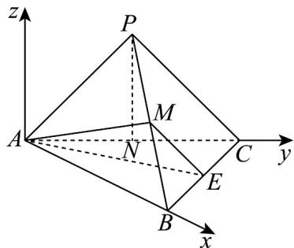

> [!faq]- 《专题04 空间向量的应用（五大题型）（高效培优期中专项训练）数学人教A版2019高二选择性必修第一册》官方解析
>
> > [!success]- **【答案】** (1)证明见解析 (2) $\frac{2\sqrt{7}}{7}$
>
> > [!note]- **【分析】**
> > （1）利用中位线的性质及线面平行的判定定理得证；
> >
> > (2) 建立空间直角坐标系，求出平面的法向量，利用夹角公式及正余弦函数的平方关系得解
>
> > [!note]- **【解析】**
> > （1）因为 E，M 分别为棱 BC，BP 的中点，
> >
> > 所以 EM//PC，
> >
> > 又 $PC \subset$ 平面 $ACP$ ， $EM \notin$ 平面 $ACP$
> >
> > 所以 ME // 平面 ACP.
> >
> > (2) 取 AC 中点为 N，连接 PN
> >
> > 由 $AC = AP = CP = 2$ 可知 $PN \perp AC$ ， $PN = \sqrt{3}$
> >
> > 因为平面 $APC \perp$ 平面 $ABC$ ， $AC$ 是交线， $PN \subset$ 平面 $APC$
> >
> > 所以 $PN^{^}$ 平面 ABC ，
> >
> > 以 A 为原点，分别以 AB, AC 所在直线为 x, y 轴建立如图所示空间直角坐标系，
> >
> > 
> >
> > 则 $A(0,0,0), B(2,0,0), C(0,2,0), P(0,1,\sqrt{3}), E(1,1,0), M\left(1, \frac{1}{2}, \frac{\sqrt{3}}{2}\right)$ ,
> >
> > 所以 $\overrightarrow{AE}=(1,1,0)$ , $\overrightarrow{AM}=\left(1,\frac{1}{2},\frac{\sqrt{3}}{2}\right)$
> >
> > 设平面 AME 的一个法向量为 $n = (x, y, z)$ ,
> >
> > 则 $\left\{\begin{aligned}&\rightarrow\quad\text{回回回}\\ &n\cdot AM=x+\frac{1}{2}y+\frac{\sqrt{3}}{2}z=0\\&\rightarrow\quad\text{回回回}\\ &n\cdot AE=x+y=0\end{aligned}\right.$ ，令，则 $y=-2,z=-\frac{2\sqrt{3}}{3}$ ，
> >
> > 所以 $\vec{n} = \left(2, -2, -\frac{2\sqrt{3}}{3}\right)$
> >
> > 因为平面 $APC \perp$ 平面 $ABC$ ， $AC$ 是交线， $AB \perp AC$ ， $AB \subset$ 平面 $ABC$
> >
> > 所以 $AB \perp$ 平面 ACP，故平面 ACP 的一个法向量为 $m = (1, 0, 0)$ ，
> >
> > 所以 $\cos m, n = \frac{m \cdot n}{|m| \cdot |n|} = \frac{2}{\sqrt{4 + 4 + \frac{4}{3}}} = \frac{\sqrt{21}}{7}$
> >
> > 所以平面 $\underset{AME}{\text{与平面}}$ $\underset{ACP}{\text{夹角的正弦值为}} \sqrt{1-\left(\frac{\sqrt{21}}{7}\right)^{2}}=\frac{2\sqrt{7}}{7}$ .
