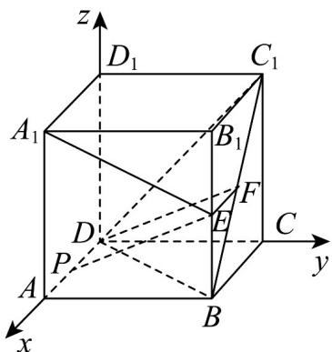
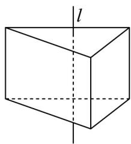
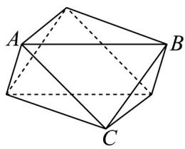
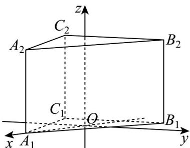

> [!faq]- 《专题04 空间向量的应用（五大题型）（高效培优期中专项训练）数学人教A版2019高二选择性必修第一册》官方解析
>
> > [!success]- **【答案】** A. 若 P 是棱 AD 的中点，则 $PE \parallel$ 平面 $BC_{1}D$ B. 点 P 到直线 $A_{1}E$ 的距离的最小值为 $\frac{4}{5}$ C. 棱 AD 上存在点 P，使得 $\angle D_{1}B_{1}P = \frac{\pi}{4}$ D. 若 P 是棱 AD 的三等分点，则过 P 的平面截球 O 所得的截面面积最小为 $\frac{2\pi}{9}$
>
> > [!note]- **【分析】**
> > 对于 A，设 $BC_{1}$ 的中点为 F，通过证明四边形 EFDP 为平行四边形，可证得 $PE \parallel$ 平面 $BC_{1}D$ ；对于 B，通过建系设点 $P(x,0,0)$ ，利用空间点到线的距离公式可求最小值；对于 C，利用向量的坐标表示出夹角 $\angle D_{1}B_{1}P$ ，计算出当 $x=\frac{1}{2}$ 时， $\angle D_{1}B_{1}P=\frac{\pi}{4}$ ，即可判断；对于 D，由题意可求 $|OP|$ ，再利用球的截面问题可直接求截面面积的最小值。
>
> > [!note]- **【解析】**
> > 如图，设 $BC_{1}$ 的中点为F，连接EF,DF，
> >
> > 
> >
> > 是 中点， ，且 ，
> >
> > $\because E \quad BB_{1} \quad \therefore EF // B_{1}C_{1} \quad EF = \frac{1}{2}B_{1}C_{1}$
> >
> > 对于 $\mathsf{A}$ ，若 $P$ 是 $AD$ 中点， $\therefore DP//BC$ ，且 $DP = \frac{1}{2} BC$
> >
> > ∴ EF // DP，且 EF = DP，所以四边形 EFDP 为平行四边形，
> >
> > $\therefore PE \parallel DF$ ，又 $PE \notin$ 平面 $BC_{1}D$ ， $DF \subset$ 平面 $BC_{1}D$
> >
> > ∴ $PE \parallel$ 平面 $BC_{1}D$ ，故 A 正确；
> >
> > 根据题意，以 D 为原点，以直线 DA, DC, DD $_{1}$ 所在方向分别为 x, y, z 轴建立空间直角坐标系，
> >
> > 设 $P(x,0,0),x\in [0,1]$ ， $A_{1}(1,0,1),E\left(1,1,\frac{1}{2}\right)$ ， $\square A_1E = \left(0,1, - \frac{1}{2}\right)$ ， $\square A_1P = (x - 1,0, - 1)$
> >
> > 所以点到直线的距离 $d = \sqrt{\left|\vec{A_1P}\right|^2 - \left(\frac{\vec{A_1P} \cdot \vec{A_1E}}{\left|A_1E\right|}\right)^2} = \sqrt{(x - 1)^2 + \frac{4}{5}}$
> >
> > 即点 $P$ 到直线 $A_{1}E$ 的距离的最小值为 $\frac{2\sqrt{5}}{5}$ ，故 ${}^{\mathrm{B}}$ 错误；
> >
> > 对于 C， $B_{1}(1,1,1), D_{1}(0,0,1)$ ，所以 $\overline{B_{1}P} = (x - 1, -1, -1), \overline{B_{1}D_{1}} = (-1, -1, 0)$
> >
> > 则 $\cos\angle D_{1}B_{1}P=\frac{\overline{B_{1}}P\cdot\overline{B_{1}}D_{1}}{\left|\overline{B_{1}}P\right|\left|\overline{B_{1}}D_{1}\right|}=\frac{-x+1+1}{\sqrt{2}\times\sqrt{(x-1)^{2}+2}}$ ，当 $x=\frac{1}{2}$ 时， $\cos\angle D_{1}B_{1}P=\frac{\sqrt{2}}{2}$ ，即 $\angle D_{1}B_{1}P=\frac{\pi}{4}$ ，
> >
> > 所以棱 $AD$ 上存在点 $P$ ，使得 $\angle D_{1}B_{1}P = \frac{\pi}{4}$ ，故C正确；
> >
> > 对于 ${}^{\mathrm{D}}$ ，当 $P$ 是棱 $AD$ 的三等分点时，点 $P\left(\frac{1}{3},0,0\right)$ 或 $P\left(\frac{2}{3},0,0\right)$ ，球心 $O\left(\frac{1}{2},\frac{1}{2},\frac{1}{2}\right)$
> >
> > 所以 $\left|OP\right|^{2}=\frac{19}{36}$ ，又正方体外接球半径 $R=\frac{\sqrt{3}}{2}$ ，
> >
> > 所以截面所得圆的最小半径 $r = \sqrt{R^2 - |OP|^2} = \sqrt{\frac{3}{4} - \frac{19}{36}} = \frac{\sqrt{2}}{3}$ ，其面积为 $S = \pi r^2 = \frac{2\pi}{9}$ ，故D正确·
> >
> > 故选：ACD.
> >
> > 39. 图①是底面边长为 $2\sqrt{3}$ 的正三棱柱，直线 $l$ 经过上下底面的中心，将图①中三棱柱的上底面绕直线 $l$ 逆时针旋转 $60^{\circ}$ 得到图②，若 $\mathrm{VABC}$ 为正三角形，则图②所示几何体的外接球的表面积为（）
> >
> > 【答案】
> >
> > 
> > 图①
> >
> > 
> > 图②
> >
> > A. $12\pi$ B. $8\sqrt{6}\pi$ C. $24\pi$ D. $24\sqrt{6}\pi$
> >
> > 【答案】C
> >
> > 【分析】由题意可得上底面绕直线 l 逆时针旋转 $60^{\circ}$ 得到一个对称的六面体，建立空间直角坐标系，求出旋转前后的坐标，根据向量的数量积求出棱柱的高，根据勾股定理求出外接球的半径，进而求出表面积即可
> >
> > 【详解】初始几何体为底面边长为 $2\sqrt{3}$ 的正三棱柱，设高为 H，
> >
> > 上底面绕直线 l 逆时针旋转 $60^{\circ}$ 得到一个对称的六面体，其外接球球心必在旋转轴 l 上，
> >
> > 正三棱柱底面正三角形的外接圆半径 $R_{1} = \frac{2\sqrt{3}}{\sqrt{3}} = 2$ ，
> >
> > 设球心到任一底面的距离为 d，则球半径 R 满足： $R = \sqrt{R_{1}^{2} + d^{2}} = \sqrt{4 + + d^{2}}$ 由于几何体对称，球心在正中间，故 $d = \frac{H}{2}$ ，
> >
> > 如图，以下底面 $ABC$ 的重心为原点建立空间直角坐标系，
> >
> > 
> >
> > 则 $A_{1}(1,\sqrt{3},0),B_{1}(-1,\sqrt{3},0),C_{1}(-1, - \sqrt{3},0)$
> >
> > 旋转后的顶点坐标为 $A_{2}^{\prime}\left(1,\sqrt{3},H\right),B_{2}^{\prime}\left(-2,0,H\right),C_{2}^{\prime}\left(1, - \sqrt{3},H\right),$
> >
> > 所以 $A_{1}A_{2}^{\prime} = (-1,\sqrt{3},H)$ ，长度 $\sqrt{1 + 3 + H^2} = \sqrt{4 + H^2}$
> >
> > 所以数量积为； $(-1)\cdot (-1) + \sqrt{3}\cdot (-\sqrt{3}) + H^{2} = H^{2} - 2$
> >
> > 由夹角 $60^{\circ}$
> >
> > 所以 $\cos60^{\circ}=\frac{H^{2}-2}{4+H^{2}}=\frac{1}{2}\Rightarrow H=2\sqrt{2}$
> >
> > 球心在中间，高度 $d=\frac{H}{2}=\sqrt{2}$ ，
> >
> > 半径 $R = \sqrt{4 + 2} = \sqrt{6}$
> >
> > 所以表面积 $S = 4\pi R^{2} = 4\pi \times 6 = 24\pi$ ,
> >
> > 故选；C
