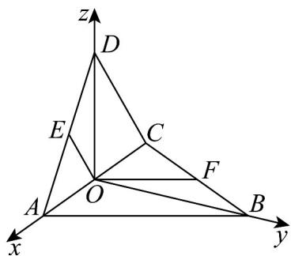
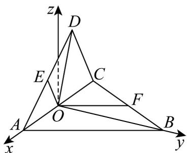

> [!faq]- 《专题04 空间向量的应用（五大题型）（高效培优期中专项训练）数学人教A版2019高二选择性必修第一册》官方解析
>
> > [!success]- **【答案】** $^{(1)}\frac{\pi}{3}$ (2) $\frac{2\sqrt{5}}{5}$
>
> > [!note]- **【分析】**
> > （ $^{1}$ ）建立空间直角坐标系利用向量夹角的坐标表示即可求得其大小；
> >
> > (2) 建立新的空间直角坐标系利用线面角的向量求法计算可得结果.
>
> > [!note]- **【解析】**
> > （1）根据题意可知 $OB \perp OA, OD \perp OA$ ，所以 $\angle BOD$ 即为二面角 $B - AC - D$ 的平面角，当折成直二面角时，可得 $OB \perp OD$ ，
> >
> > <!-- source-part:2 pages:51-67 -->
> >
> > 以 O 为坐标原点，直线 OA, OB, OD 分别为 x, y, z 轴建立空间直角坐标系，如下图所示：
> >
> > 
> >
> > 设正方形 ABCD 的边长为 $^{2}$ ,
> >
> > 则 $O(0,0,0),A(\sqrt{2},0,0),B(0,\sqrt{2},0),C(-\sqrt{2},0,0),D(0,0,\sqrt{2})$
> >
> > 又 $E$ ， $F$ 分别为 $AD$ ， $BC$ 的中点，所以 $E\left(\frac{\sqrt{2}}{2},0,\frac{\sqrt{2}}{2}\right),F\left(-\frac{\sqrt{2}}{2},\frac{\sqrt{2}}{2},0\right)$
> >
> > 可得 $\overrightarrow{OE}=\left(\frac{\sqrt{2}}{2},0,\frac{\sqrt{2}}{2}\right),\overrightarrow{OF}=\left(-\frac{\sqrt{2}}{2},\frac{\sqrt{2}}{2},0\right)$
> >
> > 因此 $\cos\overrightarrow{OE},\overrightarrow{OF}=\frac{\overrightarrow{OE}\cdot\overrightarrow{OF}}{\left|\overrightarrow{OE}\right|\left|\overrightarrow{OF}\right|}=\frac{-\frac{1}{2}}{1\times1}=-\frac{1}{2}$ ，所以 $\angle EOF=\frac{2\pi}{3}$ ;
> >
> > 可得直线 $OE$ 与 $OF$ 所成角的大小为 $\frac{\pi}{3}$ ；
> >
> > (2) 由 (1) 可知，当折成二面角 $B - AC - D$ 的平面角为 $60^{\circ}$ ，即 $\angle BOD = 60^{\circ}$ ；
> >
> > 在平面 $BOD$ 内，过点 $O$ 作垂直于 $OB$ 的直线作为 $z$ 轴，以 $O$ 为坐标原点，直线 $OA, OB$ 分别为 $x, y$ 轴建立空间直角坐标系，如下图所示：
> >
> > 
> >
> > 则 $O(0,0,0), A(\sqrt{2}, 0, 0), B(0, \sqrt{2}, 0), C(-\sqrt{2}, 0, 0), D\left(0, \frac{\sqrt{2}}{2}, \frac{\sqrt{6}}{2}\right)$
> >
> > 又 $E$ ， $F$ 分别为 $AD$ ， $BC$ 的中点，所以 $E\left(\frac{\sqrt{2}}{2}, \frac{\sqrt{2}}{4}, \frac{\sqrt{6}}{4}\right), F\left(-\frac{\sqrt{2}}{2}, \frac{\sqrt{2}}{2}, 0\right)$ ；
> >
> > 可得 $OE = \left( \frac{\sqrt{2}}{2}, \frac{\sqrt{2}}{4}, \frac{\sqrt{6}}{4} \right)$ , $OF = \left( -\frac{\sqrt{2}}{2}, \frac{\sqrt{2}}{2}, 0 \right)$ , $BD = \left( 0, -\frac{\sqrt{2}}{2}, \frac{\sqrt{6}}{2} \right)$ ,
> >
> > 设平面 OEF 的一个法向量为 $n = (x, y, z)$ ,
> >
> > 则 $\left\{ \begin{array}{l} \rightarrow \square \square \square \\ n \cdot OE = \frac{\sqrt{2}}{2} x + \frac{\sqrt{2}}{4} y + \frac{\sqrt{6}}{4} z = 0 \\ \rightarrow \square \square \square \\ n \cdot OF = -\frac{\sqrt{2}}{2} x + \frac{\sqrt{2}}{2} y = 0 \end{array} \right.$ ，取，则； $x = 1$ $y = 1, z = -\sqrt{3}$
> >
> > 所以 $n = (1, 1, -\sqrt{3})$ ;
> >
> > 设直线 BD 与平面 OEF 所成的角为 $\theta$
> >
> > 可得 $\sin\theta=\left|\cos\overrightarrow{BD},\overrightarrow{n}\right|=\frac{\left|\overrightarrow{BD}\cdot\overrightarrow{n}\right|}{\left|\overrightarrow{BD}\right|\left|n\right|}=\frac{\left|-2\sqrt{2}\right|}{\sqrt{2}\times\sqrt{5}}=\frac{2\sqrt{5}}{5}$ ;
> >
> > 所以直线 $BD$ 与平面 $OEF$ 所成角的正弦值为 $\frac{2\sqrt{5}}{5}$
> >
> > ## 考点 05 用空间向量研究距离问题
