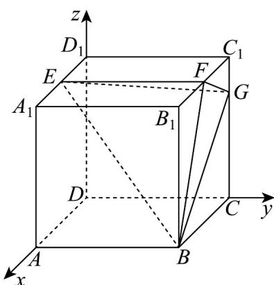

> [!faq]- 《专题04 空间向量的应用（五大题型）（高效培优期中专项训练）数学人教A版2019高二选择性必修第一册》官方解析
>
> > [!success]- **【答案】** (1)证明见解析； (2) $\frac{4}{5}$ ; (3) $\frac{8\sqrt{5}}{5}$ .
>
> > [!note]- **【分析】**
> > （1）法一、利用正方形的性质先证明 $FG \perp BF$ ，再结合正方体的性质得出 $EF \perp$ 平面 $BCC_{1}B_{1}$ ，利用线面垂直的性质与判定定理证明即可；法二、建立空间直角坐标系，利用空间向量证明线面垂直即可；（2）利用空间向量计算面面夹角即可；
> >
> > (3) 利用空间向量计算点面距离即可·
>
> > [!note]- **【解析】**
> > $(1)(1)$ 法一、在正方形 $BCC_{1}B_{1}$ 中，
> >
> > 由条件易知 $\tan \angle C_1FG = \frac{C_1G}{C_1F} = \frac{1}{2} = \frac{FB_1}{BB_1} = \tan \angle B_1BF$ ，所以 $\angle C_1FG = \angle B_1BF$
> >
> > 则 $\angle B_{1}FB + \angle B_{1}BF = \frac{\pi}{2} = \angle C_{1}FG + \angle B_{1}FB$
> >
> > 故 $\angle BFG = \pi -\left(\angle C_1FG + \angle B_1FB\right) = \frac{\pi}{2}$ ，即 $FG\perp BF$
> >
> > 在正方体中，易知 $D_{1}C_{1}\perp$ 平面 $BCC_{1}B_{1}$ ，且 $EF / / D_1C_1$
> >
> > 所以 $EF \perp$ 平面 $BCC_{1}B_{1}$
> >
> > 又 $FG \subset$ 平面 $BCC_{1}B_{1}$ , $\therefore EF \perp FG$
> >
> > $\because EF \cap BF = F, EF, BF \subset$ 平面 $EBF, \therefore GF \perp$ 平面 $EBF$ ;
> >
> > ## 法二、如图以 D 为原点建立空间直角坐标系，
> >
> > 则 $B(4,4,0)$ , $E(2,0,4)$ , $F(2,4,4)$ , $G(0,4,3)$
> >
> > 所以 $EF = (0, 4, 0)$ , $EB = (2, 4, -4)$ , $FG = (-2, 0, -1)$ ,
> >
> > 设 $m = (a, b, c)$ 是平面EBF的法向量，
> >
> > 则 $\left\{ \begin{array}{l}m\cdot EE = 4b = 0\\ \rightarrow \square \square \\ m\cdot EB = 2a + 4b - 4c = 0 \end{array} \right.$ ，令 $a = 2$ ，则 $b = 0,c = 1$
> >
> > 所以 $m=(2,0,1)$ 是平面 EBF 的一个法向量，
> >
> > 易知 $\overline{FG} = -m$ ，则 $\overline{FG}$ 也是平面 $EBF$ 的一个法向量， $\therefore GF \perp$ 平面 $EBF$ ；
> >
> > (2) 同上法二建立的空间直角坐标系，
> >
> > 所以 $\stackrel{\square\square\square}{EG} = (-2,4,-1), \stackrel{\square\square\square}{BG} = (-4,0,3)$
> >
> > 由（1）知 $m = (2,0,1)$ 是平面EBF的一个法向量，
> >
> > 设平面 $_{EBG}$ 的一个法向量为 $n=\left(x,y,z\right)$ ，所以 $\begin{cases}n\cdot EG=-2x+4y-z=0\\n\cdot BG=-4x+3z=0\end{cases}$ ，
> >
> > 令 x = 6 ，则 z = 8, y = 5 ，
> >
> > 所以 $n=(6,5,8)$ 平面 EBG 的一个法向量，
> >
> > 设平面 $EBF$ 与平面 $EBG$ 的夹角为 $\alpha$
> >
> > 则 $\cos\alpha=\left|\cos m,n\right|=\frac{\left|m\cdot n\right|}{\left|m\right|\cdot\left|n\right|}=\frac{20}{\sqrt{5}\times\sqrt{125}}=\frac{4}{5}$
> >
> > 所以平面 $EBF$ 与平面 $EBG$ 的夹角的余弦值为 $\frac{4}{5}$ ；
> >
> > (3) 因为 $D(0,0,0)$ , $E(2,0,4)$ ，所以 $\overline{DE} = (2,0,4)$
> >
> > 又 $m=(2,0,1)$ 是平面 EBF 的一个法向量，
> >
> > 则 $D$ 到平面 $\underset{EBF}{\text{的距离为}} d = \frac{\left|\overrightarrow{DE} \cdot m\right|}{\left|m\right|} = \frac{8}{\sqrt{5}} = \frac{8\sqrt{5}}{5}$ .
> >
> > 所以点 $D$ 到平面 $EBF$ 的距离为 $\frac{8\sqrt{5}}{5}$ .
> >
> > 
