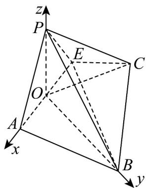

> [!faq]- 《专题04 空间向量的应用（五大题型）（高效培优期中专项训练）数学人教A版2019高二选择性必修第一册》官方解析
>
> > [!success]- **【答案】** (1)证明见解析 (2) $\frac{2\sqrt{22}}{11}$ . (3) $Q$ 点不在 $\triangle POC$ 内
>
> > [!note]- **【分析】**
> > （1）取 $AE$ 的中点 $O$ ，通过证明 $OP \perp AE$ 和 $OP \perp OC$ ，证得 $OP \perp$ 平面 $ABCE$ ，可证平面 $PAE \perp$ 平面 $ABCE$ ；
> >
> > (2) 以 O 点为原点建立空间直角坐标系，向量法求点到平面的距离；
> >
> > (3) 设 $Q(a, b, c)$ ，由 $Q$ 在平面 $POC$ 内可知 $b = -\frac{a}{2}$ ，再由 $EQ \perp$ 平面 $PBC$ ，求出 $Q$ 点坐标，判断结论即可.
>
> > [!note]- **【解析】**
> > （1）取 $AE$ 的中点 $O$ ，连结 $OP$ ， $OC$ ，因为 $PA = PE$ ，所以 $OP \perp AE$
> >
> > 在 Rt△APE 中，AP = PE = 2，所以 OP = $\sqrt{2}$
> >
> > 在 $\triangle OEC$ 中， $OC^2 = OE^2 +CE^2 -2OE\cdot CE\cos 135^\circ = \sqrt{2}^2 +2^2 -2\times \sqrt{2}\times 2\times \left(-\frac{\sqrt{2}}{2}\right) = 10$
> >
> > 在 $\triangle POC$ 中， $OP = OD = \sqrt{2}$ ， $OC = \sqrt{10}$ ， $PC = 2\sqrt{3}$ ，所以 $OP^2 + OC^2 = PC^2$
> >
> > 所以 $OP \perp OC$ ，又因为 $AE \cap OC = O$ ，AE， $OC \subset$ 平面 ABCE，所以 $OP \perp$ 平面 ABCE，
> >
> > 又 $OP \subset$ 平面 $PAE$ ，所以平面 $PAE \perp$ 平面 $ABCE$ .
> >
> > (2) 连结 OB, BE, $BE = \sqrt{BC^{2} + CE^{2}} = \sqrt{4^{2} + 2^{2}} = 2\sqrt{5}$ ,
> >
> > $AB=\sqrt{CD^{2}+(BC-AD)^{2}}=\sqrt{4^{2}+(4-2)^{2}}=2\sqrt{5}$ ，所以 $OB\perp AE$ ，
> >
> > 且 $OB = \sqrt{BE^2 - OE^2} = \sqrt{20 - 2} = 3\sqrt{2}$ ，由（1）可知 $OP \perp$ 平面 $ABCE$
> >
> > 又因为 OA, OB ⊂ 平面 ABCE,
> >
> > 所以 $OP \perp OA$ ， $OP \perp OB$ ，所以 OP，OA，OB 两两垂直，
> >
> > 如图，以 O 点为原点建立如图所示的空间直角坐标系，
> >
> > 
> >
> > 则 $O(0,0,0), A(\sqrt{2},0,0), B(0,3\sqrt{2},0), C(-2\sqrt{2},\sqrt{2},0), P(0,0,\sqrt{2}), E(-\sqrt{2},0,0)$
> >
> > $$
> > \stackrel {\sqcup \sqcup \sqcup} {C B} = (2 \sqrt {2}, 2 \sqrt {2}, 0) \stackrel {\sqcup \sqcup \sqcup} {P B} = (0, 3 \sqrt {2}, - \sqrt {2}) \stackrel {\sqcup \sqcup \sqcup} {E P} = (\sqrt {2}, 0, \sqrt {2})
> > $$
> >
> > 设平面 $PBC$ 的法向量为 $n = (x,y,z)$ ，则 $\left\{ \begin{array}{l} CB \cdot n = 0 \\ PB \cdot n = 0 \end{array} \right. \Rightarrow \left\{ \begin{array}{l} 2\sqrt{2} x + 2\sqrt{2} y = 0 \\ 3\sqrt{2} y - \sqrt{2} z = 0 \end{array} \right.$
> >
> > 取 $x = 1$ ，得 $y = -1, z = -3$ ，则 $n = (1, -1, -3)$
> >
> > 所以点 $E$ 到平面 $PBC$ 的距离 $d = \frac{\left|\overrightarrow{EP} \cdot \overrightarrow{n}\right|}{\left|n\right|} = \frac{\left|\sqrt{2} - 3\sqrt{2}\right|}{\sqrt{11}} = \frac{2\sqrt{22}}{11}$ .
> >
> > (3) 设 $Q(a, b, c)$ ，由 $Q$ 在平面 $POC$ 内可知 $OQ = \lambda OC + \mu OP$
> >
> > 即 $(a,b,c) = \lambda (-2\sqrt{2},\sqrt{2},0) + \mu (0,0,\sqrt{2})\Rightarrow a = -2\sqrt{2}\lambda ,b = \sqrt{2}\lambda ,c = \sqrt{2}\mu$
> >
> > 所以 $b = -\frac{a}{2}$ ，即 $Q\left(a, -\frac{a}{2}, c\right)$ ，所以 $\overline{EQ} = \left(a + \sqrt{2}, -\frac{a}{2}, c\right)$
> >
> > 因为 $EQ \perp$ 平面 $PBC$ ，所以 $\overline{EQ}$ 是平面 $PBC$ 的一个法向量，所以 $\overline{EQ} //n$
> >
> > 即 $\frac{a + \sqrt{2}}{1} = \frac{-\frac{a}{2}}{-1} = \frac{c}{-3}$ ，解得 $a = -2\sqrt{2}, c = 3\sqrt{2}$ 故 $Q(-2\sqrt{2}, \sqrt{2}, 3\sqrt{2})$
> >
> > 而 $C\left(-2\sqrt{2}, \sqrt{2}, 0\right)$ ，可知 $Q$ 点不在 $\triangle POC$ 内·
