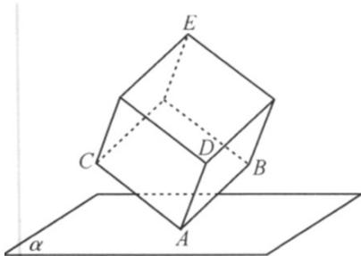
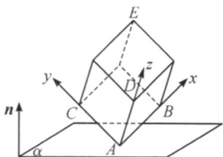

> [!faq]- 《专题04 空间向量的应用（五大题型）（高效培优期中专项训练）数学人教A版2019高二选择性必修第一册》官方解析
>
> > [!success]- **【答案】** 
>
> > [!note]- **【分析】**
> > 建立空间直角坐标系，写出点的坐标，设平面 $\alpha$ 的法向量为 $\frac{\mathrm{r}}{n} = (x, y, z)$ ， $|n| = 1$ ，从而由点到平面的距离公式得到方程，求出 $\frac{\mathrm{r}}{n} = \left(\frac{\sqrt{2}}{3}, \frac{1}{3}, \frac{\sqrt{6}}{3}\right)$ ，从而求出答案：
>
> > [!note]- **【解析】**
> > 以正方体顶点 A 为坐标原点，AB 为 x 轴，AC 为 y 轴，AD 为 z 轴建立如图所示的空间直角坐标系，
> >
> > 则 $A(0,0,0), B(3,0,0), C(0,3,0), D(0,0,3), E(3,3,3)$
> >
> > 故 $AB = (3,0,0), AC = (0,3,0)$
> >
> > 设平面 $\alpha$ 的法向量为 $\stackrel{\Gamma}{n} = (x, y, z)$ ， $|n| = 1$ ，
> >
> > 
> >
> > 所以 $\left\{ \begin{array}{l} AB \cdot n = 3x = 1 \\ AC \cdot n = 3y = \sqrt{2} \\ x^2 + y^2 + z^2 = 1 \end{array} \right.$ ，解得 $\left\{ \begin{array}{l} x = \frac{1}{3} \\ y = \frac{\sqrt{2}}{3} \\ z = \frac{\sqrt{6}}{3} \end{array} \right.$
> >
> > 故 $\frac{\mathrm{r}}{n} = \left(\frac{1}{3},\frac{\sqrt{2}}{3},\frac{\sqrt{6}}{3}\right)$
> >
> > 设点 E 到平面 $\alpha$ 的距离为 h ，
> >
> > 则 $h=\frac{\left|\overrightarrow{AE}\cdot n\right|}{\left|n\right|}=\left|\left(3,3,3\right)\cdot\left(\frac{1}{3},\frac{\sqrt{2}}{3},\frac{\sqrt{6}}{3}\right)\right|=1+\sqrt{2}+\sqrt{6}$ .
> >
> > 故答案为： $1 + \sqrt{2} +\sqrt{6}$
