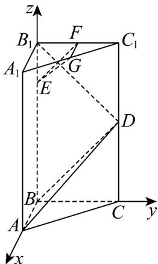

> [!faq]- 《专题04 空间向量的应用（五大题型）（高效培优期中专项训练）数学人教A版2019高二选择性必修第一册》官方解析
>
> > [!success]- **【答案】** (1)证明见解析； (2) $\frac{3\sqrt{2}}{2}$ .
>
> > [!note]- **【分析】**
> > （ $^{1}$ ）根据给定条件，建立空间直角坐标系，利用空间位置的向量证明推理即得
> >
> > (2) 由 (1) 中信息，利用点到平面的距离公式计算即得
>
> > [!note]- **【解析】**
> > （1）在直三棱柱 $ABC-A_{1}B_{1}C_{1}$ 中， $\angle ABC=90^{\circ}$ ，则直线BA,BC,BB $_{1}$ 两两垂直，以点B为原点，直线BA,BC,BB $_{1}$ 分别为x,y,z轴建立空间直角坐标系，设AB=2a，
> >
> > $$
> > B (0, 0, 0), A (2 a, 0, 0), B _ {1} (0, 0, 4), D (0, 2, 2), E (0, 0, 3), F (0, 1, 4), G (a, 1, 4)
> > $$
> >
> > $\overline{B_{1}D}=(0,2,-2),\overline{BA}=(2a,0,0),\overline{BD}=(0,2,2)$ ，于是 $\overline{B_{1}D}\cdot\overline{BA}=0,\overline{B_{1}D}\cdot\overline{BD}=0$
> >
> > 即 $B_{1}D \perp BA, B_{1}D \perp BD$ ，因此直线 $B_{1}D \perp BA, B_{1}D \perp BD$
> >
> > 而 $BA \cap BD = B, BA, BD \subset$ 平面 ABD ，则 $B_{1}D \perp$ 平面 ABD ；
> >
> > 又 $EF = (0,1,1), EG = (a,1,1)$ ，则 $B_{1}D \cdot EF = 0, B_{1}D \cdot EG = 0$ ，直线 $B_{1}D \perp EF, B_{1}D \perp EG$ 而 $EF \cap EG = E, EF, EG \subset$ 平面 EGF ，则 $B_{1}D \perp$ 平面 EGF ，又点 $E \notin$ 平面 ABD ，所以平面 $EGF //$ 平面 ABD ·
> >
> > 
> >
> > (2) 由 (1) 得，平面 $ABD$ 的一个法向量为 $\overline{B_1D} = (0,2, - 2)$ ，而 $\overline{BE} = (0,0,3)$
> >
> > 则点 $E$ 到平面 $ABD$ 的距离 $d = \frac{|BE:B|}{|B_1D|} = \frac{6}{2\sqrt{2}} = \frac{3\sqrt{2}}{2}$
> >
> > 由平面 $EGF / /$ 平面ABD，得平面EGF与平面ABD的距离等于点E到平面ABD的距离，
> >
> > 所以平面 $EGF$ 与平面 $ABD$ 的距离为 $\frac{3\sqrt{2}}{2}$ .
> >
> > 45. 空间直角坐标系中 $A(0,0,0)$ , $B(1,1,1)$ , $C(1,0,0)$ , $D(-1,2,1)$ , 其中 $A \in \alpha$ , $B \in \alpha$ , $C \in \beta$ , $D \in \beta$ , 已知平面 $\alpha //$ 平面 $\beta$ , 则平面 $\alpha$ 与平面 $\beta$ 间的距离为 \_\_\_\_.
> >
> > 【答案】 $\frac{\sqrt{26}}{26}$
> >
> > 【分析】由已知得 $AB, CD, AC$ ，设向量 $n = (x, y, z)$ 与向量 $AB, CD$ 都垂直，由向量垂直的坐标运算可求得 $n$ ，再由平行平面的距离公式计算可得结果。
> >
> > 【详解】由已知得 $AB = (1,1,1)$ ， $CD = (-2,2,1)$ ， $AC = (1,0,0)$
> >
> > 设向量 $n = (x,y,z)$ 与向量 $\underset{AB,CD}{\underset{\square}{\longrightarrow}}$ 都垂直，则 $\left\{ \begin{array}{l} n \cdot AB = 0 \\ \rightarrow \square \\ n \cdot CD = 0 \end{array} \right.$ ，
> >
> > 即 $\left\{ \begin{array}{l} x + y + z = 0, \\ -2x + 2y + z = 0, \text{取} x = 1 \end{array} \right.$ ，则 $n = (1,3,-4)$ ，
> >
> > 又平面 $\alpha / /$ 平面 $\beta$ ，所以平面 $\alpha$ 与平面 $\beta$ 间的距离 $d = \frac{\left|AC\cdot n\right|}{\left|n\right|} = \frac{\left|1\times 1 + 3\times 0 + (-4)\times 0\right|}{\sqrt{1^2 + 3^2 + (-4)^2}} = \frac{\sqrt{26}}{26}$
> >
> > 故答案为： $\frac{\sqrt{26}}{26}$
