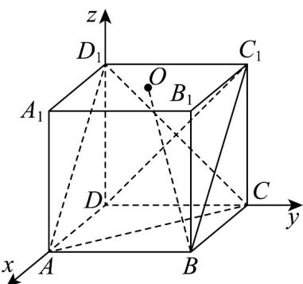

> [!faq]- 《专题04 空间向量的应用（五大题型）（高效培优期中专项训练）数学人教A版2019高二选择性必修第一册》官方解析
>
> > [!success]- **【答案】** A. $OB//$ 平面 $ACD_{1}$ B. $OB \perp C_{1}D$ C. 直线 $BC_{1}$ 与 $CD_{1}$ 的距离为 $\frac{\sqrt{3}}{3}$ D. 直线 $BC$ 与平面 $ACD_{1}$ 所成角的正弦值为 $\frac{\sqrt{3}}{3}$
>
> > [!note]- **【分析】**
> > 建立空间直角坐标系，根据向量法判断线面平行、线线垂直判断 $^{A}$ ， $^{B}$ ，运用异面直线向量距离公式求解判断 $^{C}$ ，根据向量法求解线面角判断 $^{D}$ .
>
> > [!note]- **【解析】**
> > 如图，建立空间直角坐标系，
> >
> > 
> >
> > 则 $D(0,0,0), A(1,0,0), B(1,1,0), C(0,1,0), O\left(\frac{1}{2}, \frac{1}{2}, 1\right), C_1(0,1,1), D_1(0,0,1)$
> >
> > 所以 $AC = (-1, 1, 0)$ , $AD_{1} = (-1, 0, 1)$ , OB = $\left(\frac{1}{2}, \frac{1}{2}, -1\right)$ ,
> >
> > 设平面 $ACD_{1}$ 的法向量为 $m = (x, y, z)$ ,
> >
> > 则 $\left\{ \begin{array}{l}m\cdot AC = -x + y = 0\\ \rightarrow \square \square \square \\ m\cdot AD_1 = -x + z = 0 \end{array} \right.$ ，令 $x = 1$ ，可得 $m = (1,1,1)$
> >
> > 所以 $OB \cdot m = \frac{1}{2} \times 1 + \frac{1}{2} \times 1 - 1 \times 1 = 0$ ，即 $OB \perp m$ ，
> >
> > 又因为 $OB \notin$ 平面 $ACD_{1}$ ，所以 $OB \parallel$ 平面 $ACD_{1}$ ，故 A 正确；
> >
> > $BC = (-1,0,0)$ ，平面 $ACD_{1}$ 的法向量 $m = (1,1,1)$ ，
> >
> > 设直线 BC 与平面 $ACD_{1}$ 所成角为 $\theta$ ，
> >
> > $$
> > \sin \theta = \left| \cos \overrightarrow {B C}, \overrightarrow {m} \right| = \frac {\left| \overrightarrow {B C} \cdot \overrightarrow {m} \right|}{\left| B C \right| \cdot | m |} = \left| \frac {- 1}{1 \times \sqrt {3}} \right| = \frac {\sqrt {3}}{3}
> > $$
> >
> > 所以直线 BC 与平面 $ACD_{1}$ 所成角的正弦值为 $\frac{\sqrt{3}}{3}$ ，故 D 正确；
> >
> > $$
> > \stackrel {\square \square \square} {C _ {1} D} = (0, - 1, - 1), \quad O B = \left(\frac {1}{2}, \frac {1}{2}, - 1\right)
> > $$
> >
> > 则 $OB \cdot C_{1}D = \frac{1}{2} \times 0 + \frac{1}{2} \times (-1) + (-1) \times (-1) = \frac{1}{2} \neq 0$
> >
> > 所以 $OB \perp C_{1}D$ 不成立，故 B 错误；
> >
> > 因为 $\overline{BC}_{1} = (-1,0,1), \overline{CD}_{1} = (0,-1,1)$ ，设 $n \perp \overline{BC}_{1}, n \perp \overline{CD}_{1}$ ， $n = (a,b,c)$ ，
> >
> > 则 $\left\{ \begin{array}{l} n \cdot BC = -a + c = 0 \\ n \cdot CD_{1} = -b + c = 0 \end{array} \right.$ ，令 $n = (1,1,1)$
> >
> > 又因为 $\overrightarrow{BC} = (-1, 0, 0)$ ，所以直线 $BC_{1}$ 与 $CD_{1}$ 的距离为 $\left|\frac{\overrightarrow{BC} \cdot n}{|n|}\right| = \frac{1}{\sqrt{3}} = \frac{\sqrt{3}}{3}$ ，故 C 正确。
> >
> > 故选 **ACD**
