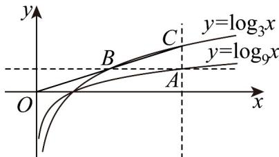

> [!faq]- 《专题05 直线的倾斜角与斜率（六大题型）（高效培优期中专项训练）数学人教A版2019高二选择性必修第一册》官方解析
>
> > [!success]- **【答案】** B
>
> > [!note]- **【分析】**
> > 根据斜率公式结合已知斜率可求实数 $a$ ·
>
> > [!note]- **【解析】**
> > 过 $A(2,a)$ ， $B(-a,2a - 1)$ 两点的直线斜率为 $\frac{2a - 1 - a}{-a - 2} = 1$
> >
> > 所以 $2a - 1 - a = -a - 2$ ，解得， $a = -\frac{1}{2}$
> >
> > 故选：B
> >
> > 13．过 $A(3m-1,3m-2)$ ， $B(2m^{2},m^{2})$ 两个不同点的直线 l 的斜率为 1，则实数 m 的值为 \_\_\_\_。
> >
> > 【答案】-1
> >
> > 【分析】根据斜率公式列式求解即可·
> >
> > 【详解】根据题意可得 $\frac{m^{2}-3m+2}{2m^{2}-3m+1}=1$ ，解得m=1或-1，
> >
> > 当 $m = 1$ 时，点 $A$ ， $B$ 重合，不符合题意，舍去；
> >
> > 当 $m = -1$ 时，经验证，符合题意；
> >
> > 综上所述： $m = -1$
> >
> > 故答案为：-1·
> >
> > 14. 过 $A(m^{2} + 2, m^{2} - 3)$ ， $B(3 - m - m^{2}, 2m)$ 两点的直线 $l$ 的倾斜角为 $45^{\circ}$ ，则 $m$ 等于（）
> >
> > 【答案】
> > A. -2 B. -1 C. -1, -2 D. 1, 2
> >
> > 【答案】A
> >
> > 【分析】根据给定条件，利用斜率的坐标公式列式求解·
> >
> > 【详解】依题意， $\tan 45^{\circ} = \frac{m^{2} - 3 - 2m}{m^{2} + 2 - (3 - m - m^{2})} = \frac{(m - 3)(m + 1)}{(2m - 1)(m + 1)} = \frac{m - 3}{2m - 1} = 1$ ，所以 $m = -2$
> >
> > 故选：A
> >
> > 15．过曲线 $y=\log_{9}x$ 上一点 A 作平行于两坐标轴的直线，分别交曲线 $y=\log_{3}x$ 于点 B，C，若直线 BC 过原点，则其斜率为 \_\_\_\_。
> >
> > 【答案】 $\frac{\log_32}{2}$
> >
> > 【分析】利用对数的运算法则结合两点斜率公式计算即可·
> >
> > 【详解】
> >
> > 
> >
> > 不妨设 $A\left(x_0, \frac{1}{2} \log_3 x_0\right)$ ，则 $B\left(\sqrt{x_0}, \frac{1}{2} \log_3 x_0\right)$ ， $C\left(x_0, \log_3 x_0\right)$ ，
> >
> > 由题意可得 $k_{BO} = k_{OC} \Rightarrow \frac{\log_3 x_0}{x_0} = \frac{\frac{1}{2} \log_3 x_0}{\sqrt{x_0}}$ ，解得 $x_0 = 4$ 或 $x_0 = 1$
> >
> > 经过检验 $x_{0}=1$ 不符合，故舍去，
> >
> > 故其斜率为 $\frac{\log_{3}4}{4}=\frac{\log_{3}2}{2}$ .
> >
> > 故答案为： $\frac{\log_{3}2}{2}$
> >
> > 16. 经过点 $A(2,5)$ 和 $B(-1,m)$ 的直线的倾斜角为 $\frac{\pi}{4}$ ，则 $m = (\quad)$ A 3.5 B 8 C -2 D 2
> >
> > 【答案】D
> >
> > 【分析】由两点坐标写出直线斜率，根据直线斜率的定义建立方程，求解即得
> >
> > 【详解】依题意，直线 $AB$ 的斜率为 $k_{AB} = \frac{m - 5}{-3} = \tan \frac{\pi}{4}$ ，解得 $m = 2$
> >
> > 故选：D.
> >
> > 17. 三点 $A(2,2)$ , $B(5,1)$ , $C(m,4)$ 在同一条直线上，则 $m$ 的值为（） A. 2 B. 4 C. -2 D. -4
> >
> > 【答案】D
> >
> > 【分析】根据两点斜率表达式得到方程，解出即可·
> >
> > 【详解】显然 $m \neq 5$ ，则 $k_{BC} = k_{AB}$ ，即 $\frac{4 - 1}{m - 5} = \frac{1 - 2}{5 - 2}$ ，解得 $m = -4$ 。
> >
> > 故选 **D**.
