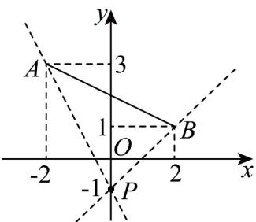

> [!faq]- 《专题05 直线的倾斜角与斜率（六大题型）（高效培优期中专项训练）数学人教A版2019高二选择性必修第一册》官方解析
>
> > [!success]- **【答案】** C
>
> > [!note]- **【分析】**
> > 先利用直线的斜率公式计算 $k_{PA}$ ， $k_{PB}$ ；再结合图形，利用直线与线段有交点的条件建立不等式，即可得出结果·
>
> > [!note]- **【解析】**
> > 由直线的斜率公式可得：
> >
> > $$
> > k _ {P A} = \frac {3 - (- 1)}{- 2 - 0} = - 2, k _ {P B} = \frac {1 - (- 1)}{2 - 0} = 1.
> > $$
> >
> > 
> >
> > 结合图形，要使直线 l 经过点 $P(0,-1)$ ，且与线段 AB 有交点，l 的斜率需满足 $k \leq -2$ 或 k = 1。
> >
> > 故选 **C**.
