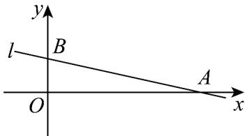

> [!faq]- 《专题06 直线方程考点全方位总结（六大题型）（高效培优期中专项训练）数学人教A版2019高二选择性必修第一册》官方解析
>
> > [!success]- **【答案】** (1) $5x+4y-15=0$ (2) $4x - 5y - 9 = 0$
>
> > [!note]- **【分析】**
> > （1）求出点 B 的坐标，直线 BC 的斜率，利用直线的点斜式方程求解
> >
> > (2) 由 (1) 求出直线 $AD$ 的斜率, 进而求出直线方程.
>
> > [!note]- **【解析】**
> > （1）由 $A(1, - 1)$ ，边 $AB$ 的中点 $M(0,2)$ ，得点 $B(-1,5)$ ，又点 $C(3,0)$
> >
> > 则直线 $BC$ 的斜率 $k_{BC} = \frac{5 - 0}{-1 - 3} = -\frac{5}{4}$ ，直线 $BC$ 的方程为 $y = -\frac{5}{4} (x - 3)$ ，即 $5x + 4y - 15 = 0$
> >
> > 所以 BC 所在直线的方程为 $5x + 4y - 15 = 0$ .
> >
> > (2) 由 (1) 知，直线 $_{AD}$ 的斜率 $k_{AD} = -\frac{1}{k_{BC}} = \frac{4}{5}$ ，
> >
> > 所以高 $AD$ 所在直线的方程为 $y + 1 = \frac{4}{5} (x - 1)$ ，即 $4x - 5y - 9 = 0\cdot$
> >
> > ## 考点02 直线与坐标轴围成的面积问题
> >
> > 11. 直线 $l$ 的方程为 $\left(a + 1\right)x - y - 3a - 1 = 0$ ， $a \in \mathbf{R}$ .
> >
> > (1)若直线 l 在两坐标轴上的截距相等，求 l 的方程；
> >
> > (2)若直线 l 分别交 x 轴、y 轴的正半轴于点 A、B，点 O 是坐标原点．若 VAOB 的面积为 16，求 a 的值.
> >
> > 【答案】(1) $x + y - 5 = 0$ 或 $2x - 3y = 0$
> >
> > (2) $a = -3$ 或 $a = -\frac{11}{9}$
> >
> > 【分析】（1）根据直线截距的概念，分别令 $x = 0$ 、 $y = 0$ 列式求解即可；
> >
> > (2) 分别求出直线在 $x$ 轴、 $y$ 轴的截距，代入三角形面积公式可得 $S = -\frac{(3a + 1)^2}{2(a + 1)}$ ，直接解一元二次方程
> >
> > 求解·
> >
> > 【详解】（1）当 $a + 1 = 0$ 即 $a = -1$ 时，直线 $l$ 的方程为 $y = 2$ ，不满足题意；
> >
> > 当 $a + 1 \neq 0$ ，即 $a \neq -1$ 时，令 $x = 0$ 得 $y = -3a - 1$ ，令 $y = 0$ ，得 $x = \frac{3a + 1}{a + 1}$ ，
> >
> > 由截距相等得 $\frac{3a + 1}{a + 1} = -3a - 1$ ，解得 $a = -2$ 或 $a = -\frac{1}{3}$
> >
> > 当 $a = -2$ 时，直线 $l$ 的方程为 $x + y - 5 = 0$ ，当 $a = -\frac{1}{3}$ 时，直线 $l$ 的方程为 $2x - 3y = 0$ ，
> >
> > 故综上所述，所求直线 $l$ 的方程为 $x + y - 5 = 0$ 或 $2x - 3y = 0$
> >
> > (2) 由题意知， $a+1 \neq 0$ ， $-3a-1 \neq 0$ ，且 l 在 x 轴、y 轴上的截距分别为 $\frac{3a+1}{a+1}$ 、-3a-1，
> >
> > 所以 $\left\{\begin{aligned}\frac{3a+1}{a+1}&>0\\ -3a-1&>0\end{aligned}\right.$ ，解得 a<-1，
> >
> > 所以 $\mathrm{V}_{AOB}$ 的面积 $S = \frac{1}{2}\left(\frac{3a + 1}{a + 1}\right)(-3a - 1) = -\frac{(3a + 1)^2}{2(a + 1)}$
> >
> > 
> >
> > 由题意知 $-\frac{(3a+1)^{2}}{2(a+1)}=16$ ，化简得 $9a^{2}+38a+11=0$ ，解得a=-3或 $a=-\frac{11}{9}$ ，均满足条件，
> > 所以 a = -3 或 $a = -\frac{11}{9}$ .
> >
> > 12．过点 $(-1,-4)$ 的直线l分别与x轴、y轴交于不同的A，B两点，O为坐标原点，若存在 $^{4}$ 条直线l使得VAOB的面积均为m，则m的取值范围是\_\_\_\_.
> >
> > 【答案】 $m > 8$
> >
> > 【分析】设直线 $AB$ 的方程为 $y + 4 = k(x + 1)$ ，求出 $A, B$ 坐标，再求得 $\mathrm{VAOB}$ 的面积，由关于 $k$ 的方程 $S_{\triangle OAB} = m$ 有四个不等的实根可求得 $m$ 的范围。
> >
> > 【详解】显然直线 AB 的斜率存在且不为 $^{0}$ ，设直线 AB 的方程为 $y + 4 = k(x + 1)$ ，
> >
> > 令 x=0 得 y=k-4 ，令 y=0 得 $x=\frac{4}{k}-1$
> >
> > 则 $S_{!OAB}=\frac{1}{2}\left|k-4\right|\left|\frac{4}{k}-1\right|=\frac{1}{2}\left|8-k-\frac{16}{k}\right|$
> >
> > 由题意关于 $k$ 的方程 $\frac{1}{2}\left|8 - k - \frac{16}{k}\right| = m$ 有四个不同的实数解，
> >
> > $8 - k - \frac{16}{k} = \pm 2m$
> >
> > 所以 $k^2 +(2m - 8)k + 16 = 0$ 有两个不等实根且 $k^2 -(2m + 8)k + 16 = 0$ 有两个不等实根，
> >
> > $\left\{ \begin{array}{l} \Delta_{1} = (2m - 8)^{2} - 64 > 0 \\ \Delta_{2} = (2m + 8)^{2} - 64 > 0 \end{array} \right.$ ，解得 $m < -8$ 或 $m > 8$
> >
> > 又 $m > 0$ ，所以 $m > 8$
> >
> > 故答案为： $m > 8$
