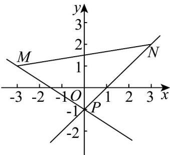

> [!faq]- 《专题06 直线方程考点全方位总结（六大题型）（高效培优期中专项训练）数学人教A版2019高二选择性必修第一册》官方解析
>
> > [!success]- **【答案】** A．坐标平面内的任何一条直线均有倾斜角和斜率 B．直线 $ax+2y+6=0$ 与直线 $x+(a-1)y+a^{2}-1=0$ 互相平行，则a=-1 C．过 $(x_{1},y_{1})$ ， $(x_{2},y_{2})$ 两点的直线方程为 $(y-y_{1})(x_{2}-x_{1})=(y_{2}-y_{1})(x-x_{1})$ D．经过点 $(1,1)$ 且在x轴和y轴上截距都相等的直线方程为 $x+y-2=0$
>
> > [!note]- **【分析】**
> > 根据直线的倾斜角与斜率判断 $^{A}$ ；根据两直线平行求出参数的值，即可判断 $^{B}$ ；根据两点式方程判断 $^{C}$ ；分截距都为与都不为两种情况讨论，即可判断 $^{D}$ .
>
> > [!note]- **【解析】**
> > $^{A}$ ：当直线倾斜角为直角的时候没有斜率，故 $^{A}$ 错误；
> >
> > B：由两直线平行可得 $a(a-1)-2=0$ ，解得 a=-1 或 2，
> >
> > 当 a=2 时，两直线重合，不符合题意，所以 a=-1 ，故 B 正确；
> >
> > C：因为 $(x_{1},y_{1})$ ， $(x_{2},y_{2})$ 两点满足方程 $(y - y_1)(x_2 - x_1) = (y_2 - y_1)(x - x_1)$ ，且过两点的直线唯一，故C正确；D：当截距都为0时直线方程为 $x = y$
> >
> > 当截距都不为 $^{0}$ 时，设直线方程为 $\frac{x}{a}+\frac{y}{a}=1(a\neq0)$ ，则 $\frac{1}{a}+\frac{1}{a}=2$ ，解得a=2，
> >
> > 所以直线方程为 $x + y - 2 = 0$
> >
> > 综上可得满足条件的直线方程为 x-y=0 或 $x+y-2=0$ ，故 D 错误.
> >
> > 故选：BC.
> >
> > 30. 以下关于直线的表述正确的是（）
> >
> > 【答案】
> >
> > A. 斜率为 -2，在 y 轴上的截距为 $^{3}$ 的直线方程为 $y = -2x + 3$ B. 经过点 $(1,1)$ 且在 x 轴和 y 轴上截距相等的直线方程为 $x + y - 2 = 0$ C. 点斜式方程 $y - y_{0} = k(x - x_{0})$ 可用于表示过点 $(x_{0}, y_{0})$ 且不与 x 轴垂直的直线
> >
> > D. 已知直线 $kx - y - 1 = 0$ 和以 $M(-3,1)$ ， $N(3,2)$ 为端点的线段相交，则实数 k 的取值范围为 $-\frac{2}{3} \leq k \leq 1$
> >
> > 【答案】AC
> >
> > 【分析】对于 $^{A}$ ：根据斜截式方程分析判断即可；对于 $^{B}$ ：举反例说明即可；对于 $^{C}$ ：根据点斜式方程分析判断即可；对于 $^{D}$ ：根据斜率公式结合图像分析求解。
> >
> > 【详解】对 A，斜率为 -2，在 y 轴上的截距为 $^{3}$ 的直线斜截式方程为 $y = -2x + 3$ ，A 正确；
> >
> > 对 B，经过点 $(1,1)$ 和原点 $(0,0)$ 的直线 y = x 也满足题意，故 B 错误；
> >
> > 对 $^{C}$ ，点斜式方程适用于斜率存在的直线， $^{C}$ 正确；
> >
> > 对 $\mathsf{D}$ ，易知直线 $kx - y - 1 = 0$ 过定点 $P(0, - 1)$
> >
> > 可得 $k_{PM} = \frac{1 - (-1)}{-3 - 0} = -\frac{2}{3}, k_{PN} = \frac{2 - (-1)}{3 - 0} = 1$
> >
> > 
> >
> > 由图和正切函数性质可知， $k \leq -\frac{2}{3}$ 或 $k = 1$ ，D 错误.
> >
> > 故选：AC.
> >
> > ## 考点 04 由直线一般方程判断平行关系
