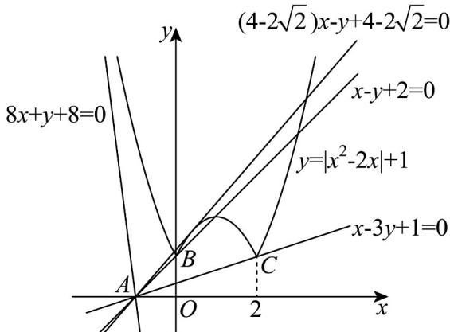

> [!faq]- 《专题06 直线方程考点全方位总结（六大题型）（高效培优期中专项训练）数学人教A版2019高二选择性必修第一册》官方解析
>
> > [!success]- **【答案】** $(1,4 - 2\sqrt{2})$
>
> > [!note]- **【分析】**
> > 先确定直线 $y = kx + k$ 恒过的定点，然后根据两点斜率公式及直线斜率的变化规律、直线与抛物线的位置关系，数形结合求解即可·
>
> > [!note]- **【解析】**
> > 直线 $y = kx + k$ 恒过点 $A(-1,0)$ 且斜率存在的动直线，
> >
> > 又 $y = \left|x^{2} - 2x\right| + 1 = \left\{ \begin{array}{ll}x^{2} - 2x + 1,x & 2\text{或} x\leq 0\\ -x^{2} + 2x + 1,0 <   x <   2 \end{array} \right.$ ，作出图象，如图：
> >
> > 
> >
> > 易知 $B(0,1), C(2,1)$
> >
> > 由 $\left\{ \begin{array}{l} y = kx + k \\ y = x^2 - 2x + 1 \end{array} \right.$ ，消 $y$ 得到 $x^2 - (k + 2)x + 1 - k = 0$ ，由 $\Delta = (k + 2)^2 - 4(1 - k) = 0$
> >
> > 得到 $k = -8$ 或 $k = 0$ （舍）（因为 $k = 0$ 时， $y = 0, x = 1$ ，不合题意），
> >
> > 所以当 $k = -8$ 时， $y = kx + k$ 与 $f(x) = x^2 - 2x + 1$ （ $x \leq 0$ 或 $x = 2$ ）相切，
> >
> > 由图可知，当 $k \leq -8$ 时，直线 $y = kx + k$ 与曲线 $y = |x^2 - 2x| + 1$ 有1个交点，不合题意；
> >
> > 当 $-8 < k < k_{AC} = \frac{1 - 0}{2 - (-1)} = \frac{1}{3}$ 时，直线 $y = kx + k$ 与曲线 $y = |x^2 - 2x| + 1$ 没有交点，不合题意；
> >
> > 当 $k = k_{AC} = \frac{1}{3}$ 时，直线 $y = kx + k$ 与曲线 $y = |x^2 - 2x| + 1$ 有1交点，不合题意；
> >
> > 当 $\frac{1}{3} = k_{AC} < k < k_{AB} = 1$ 时，直线 $y = kx + k$ 与曲线 $y = \left|x^{2} - 2x\right| + 1$ 有2交点，不合题意；
> >
> > 当 $k = k_{AB} = 1$ 时，直线 $y = kx + k$ 与曲线 $y = \left|x^{2} - 2x\right| + 1$ 有3交点，不合题意；
> >
> > 设直线 $y = kx + k$ 与曲线 $y = -x^{2} + 2x + 1, 0 < x < 1$ 相切于点 D，
> >
> > 联立 $\left\{ \begin{array}{l} y = -x^2 + 2x + 1 \\ y = kx + k \end{array} \right.$ ，消 $y$ 得 $x^2 + (k - 2)x + k - 1 = 0$ ，
> >
> > 由 $\Delta = (k - 2)^2 - 4(k - 1) = k^2 - 8k + 8 = 0$
> >
> > 解得 $k = 4 - 2\sqrt{2}$ 或 $k = 4 + 2\sqrt{2}$ （舍去，此时方程的根为 $x = -1 - \sqrt{2}$ ，不合题意）当 $k_{AB} < k < k_{AD}$ ，即 $1 < k < 4 - 2\sqrt{2}$ 时，
> >
> > 直线 $y = kx + k$ 与曲线 $y = \left|x^{2} - 2x\right| + 1$ 有4交点，符合题意；
> >
> > 当 $k = 4 - 2\sqrt{2}$ 时，直线 $y = kx + k$ 与曲线 $y = \left|x^{2} - 2x\right| + 1$ 有3交点，不合题意；
> >
> > 当 $k > 4 - 2\sqrt{2}$ 时，直线 $y = kx + k$ 与曲线 $y = \left|x^{2} - 2x\right| + 1$ 有2交点，不合题意；
> >
> > 综上， $k$ 的取值范围为 $\left(1,4 - 2\sqrt{2}\right)$ .
> >
> > 故答案为： $\left(1,4 - 2\sqrt{2}\right)$
