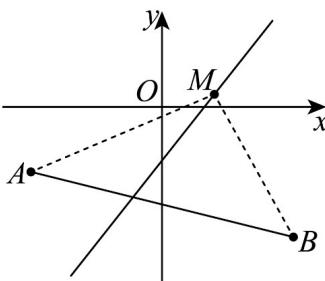

> [!faq]- 《专题06 直线方程考点全方位总结（六大题型）（高效培优期中专项训练）数学人教A版2019高二选择性必修第一册》官方解析
>
> > [!success]- **【答案】** AC
>
> > [!note]- **【分析】**
> > 求出直线过的定点判断 A；取 a=1，确定 $l_{1}, l_{2}$ 的位置关系判断 B；由垂直关系求出 a 判断 C；取 a=-1 判断 D.
>
> > [!note]- **【解析】**
> > 对于 $^{A}$ ，直线 $l_{2}:a(x-2y)+3y-1=0$ ，由 $\left\{\begin{aligned}x-2y&=0\\ 3y-1&=0\end{aligned}\right.$ ，得 $x=\frac{2}{3},y=\frac{1}{3}$ ， $l_{2}$ 始终过定点 $\left(\frac{2}{3},\frac{1}{3}\right)$ ， $^{A}$ 正确；
> >
> > 对于 $^{B}$ ，当a=1时， $l_{1}:x+y-1=0$ 与直线 $l_{2}:x+y-1=0$ 重合， $^{B}$ 错误；
> >
> > 对于 C， $l_{1} \perp l_{2}$ ，则 $a - a(2a - 3) = 0$ ，解得 a = 0 或 a = 2，C 正确；
> >
> > 对于 D，取 a = -1 ，直线 $l_{1}: x - y + 1 = 0$ 过第三象限，D 错误
> >
> > 故选：AC
> >
> > 59. 直线 $l:(m + 3)x + (m - 2)y - m - 2 = 0$ ，点 $A(-2, - 1)$ ， $B(2, - 2)$ ，若 $l$ 与线段 $AB$ 相交，则 $m$ 的范围为( ) A. $(-\infty, -4] \cup [4, +\infty)$ B. $(-2, 2)$ C. $\left[-\frac{3}{2}, 8\right]$ D. $(4, +\infty)$
> >
> > 【答案】C
> >
> > 【分析】根据直线确定定点，求出定点与已知点 $A, B$ 所成直线的斜率，数形结合得到关于 $m$ 的不等式，解之即可得解·
> >
> > 【详解】由题设，则 $\left\{ \begin{array}{l}x + y - 1 = 0\\ 3x - 2y - 2 = 0 \end{array} \right.$ ，可得 $\left\{ \begin{array}{l}x = \frac{4}{5}\\ y = \frac{1}{5} \end{array} \right.,$
> >
> > 所以直线过定点 $M\left(\frac{4}{5}, \frac{1}{5}\right)$ ，则 $k_{MA} = \frac{\frac{1}{5} + 1}{\frac{4}{5} + 2} = \frac{3}{7}$ ， $k_{MB} = \frac{\frac{1}{5} + 2}{\frac{4}{5} - 2} = -\frac{11}{6}$ ，
> >
> > 
> >
> > 由图可知直线 $l$ 的斜率 $k$ 的取值范围为： $k \leq -\frac{11}{6}$ 或 $k = \frac{3}{7}$ ，又 $k = -\frac{m + 3}{m - 2} (m \neq 2)$ ，
> >
> > 所以 $-\frac{m + 3}{m - 2} \leq -\frac{11}{6}$ 或 $-\frac{m + 3}{m - 2} = \frac{3}{7}$ ，即 $2 < m \leq 8$ 或 $-\frac{3}{2} \leq m < 2$
> >
> > 又 $m = 2$ 时直线的方程为 $x = \frac{4}{5}$ ，仍与线段 $AB$ 相交，
> >
> > 所以 $m$ 的取值范围为 $\left[-\frac{3}{2}, 8\right]$ .
> >
> > 故选 **C**
