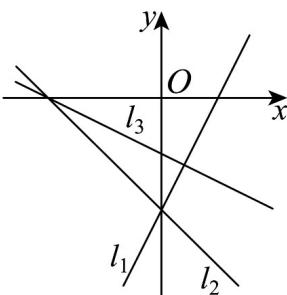
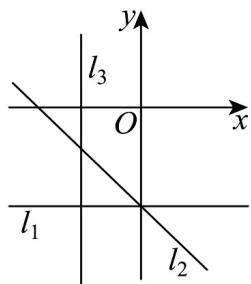
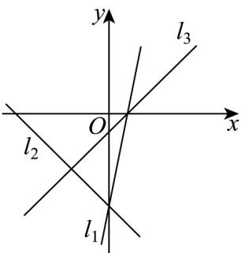

> [!faq]- 《专题07 直线交点坐标与各种距离全方位总结（九大题型）（高效培优期中专项训练）数学人教A版2019高二选择性必修第一册》官方解析
>
> > [!success]- **【答案】** A.2组 B.3组 C.4组 D.5组
>
> > [!note]- **【分析】**
> > 写出对应直线的方向向量，讨论直线垂直求参数 $a$ ，再根据所得参数值研究直线的位置情况，即可得答案：
>
> > [!note]- **【解析】**
> > 由题设， $l_{1}, l_{2}, l_{3}$ 的方向向量分别为 $m_{1} = (1, -a)$ ， $m_{2} = (1, -1)$ ， $m_{3} = (3a, -a^{2} - a + 5)$ ，
> >
> > 若 $l_{1} \perp l_{2}$ ，则 $m_{1} \cdot m_{2} = (1, -a) \cdot (1, -1) = 1 + a = 0 \Rightarrow a = -1$
> >
> > 此时 $l_{1}:-x+y+1=0$ ， $l_{2}:x+y+1=0$ ， $l_{3}:-5x-3y-3=0$ ，它们交于一点 $(0,-1)$ ，不符；
> >
> > 若 $l_{1} \perp l_{3}$ ，则 $\overline{m_1} \cdot \overline{m_3} = (1, -a) \cdot (3a, -a^2 - a + 5) = a(a^2 + a - 2) = 0 \Rightarrow a = -2$ 或 $a = 0$ 或 $a = 1$
> >
> > 当 $a = -2$ 时， $l_{1}:-2x+y+1=0$ ， $l_{2}:x+y+1=0$ ， $l_{3}:x+2y+1=0$ ，满足题设；
> >
> > 
> >
> > 当 $a = 0$ 时， $l_{1}:y + 1 = 0$ ， $l_{2}:x + y + 1 = 0$ ， $l_{3}:-5x - 3 = 0$ ，满足题设；
> >
> > 
> >
> > 当 $a = 1$ 时， $l_{1}: x + y + 1 = 0$ ， $l_{2}: x + y + 1 = 0$ 重合，不符；
> >
> > 若 $l_{2} \perp l_{3}$ ，则 $m_{2} \cdot m_{3} = (1, -1) \cdot (3a, -a^{2} - a + 5) = a^{2} + 4a - 5 = 0 \Rightarrow a = -5$ 或 $a = 1$ ，
> >
> > 当 $a = -5$ 时， $l_{1} : -5x + y + 1 = 0$ ， $l_{2} : x + y + 1 = 0$ ， $l_{3} : 5x - 5y - 1 = 0$ ，满足题设；
> >
> > 
> >
> > 当 $a = 1$ 时，同上分析，不符·
> >
> > 综上， $a = -5$ 、 $a = -2$ 、 $a = 0$ 时满足要求，故有3组·
> >
> > 故选 **B**
